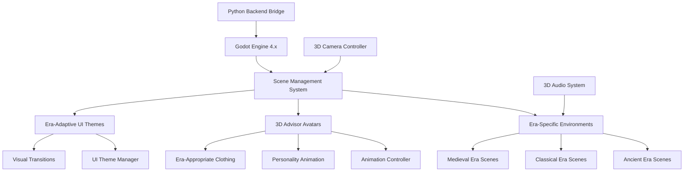

# Design Specification: 3D Interactive Game Interface

## Architecture Overview

The 3D Interactive Game Interface transforms the Political Strategy Game into a visually immersive Godot-based experience comparable to modern strategy games. The system provides era-appropriate visual environments, animated advisor avatars, and intuitive 3D interfaces that evolve with civilization development.

### High-Level System Design



## Component Design

### Era Environment System
Dynamic 3D environments that evolve with civilization development through ten distinct eras.

**Environment Architecture**:
```gdscript
# EraEnvironmentManager.gd
class_name EraEnvironmentManager
extends Node3D

@export var environment_scenes: Dictionary = {}
@export var transition_duration: float = 3.0
@export var lighting_presets: Dictionary = {}

var current_era: String = "ancient"
var current_environment: Node3D
var transition_tween: Tween

func _ready():
    load_era_environments()
    setup_lighting_system()
    initialize_ancient_environment()

func load_era_environments():
    """Load all era-specific environment scenes"""
    environment_scenes["ancient"] = preload("res://environments/AncientTribalGathering.tscn")
    environment_scenes["classical"] = preload("res://environments/ClassicalForum.tscn")
    environment_scenes["medieval"] = preload("res://environments/MedievalGreatHall.tscn")
    environment_scenes["renaissance"] = preload("res://environments/RenaissanceCourt.tscn")
    environment_scenes["industrial"] = preload("res://environments/IndustrialChamber.tscn")
    environment_scenes["modern"] = preload("res://environments/ModernWarRoom.tscn")
    environment_scenes["atomic"] = preload("res://environments/AtomicBunker.tscn")
    environment_scenes["information"] = preload("res://environments/DigitalInterface.tscn")
    environment_scenes["ai"] = preload("res://environments/AIAssistedGov.tscn")
    environment_scenes["machine_ai"] = preload("res://environments/PostHumanChamber.tscn")

func transition_to_era(new_era: String):
    """Smooth transition between era environments"""
    if new_era == current_era:
        return
        
    var new_environment = environment_scenes[new_era].instantiate()
    add_child(new_environment)
    new_environment.modulate.a = 0.0
    
    # Create dramatic transition sequence
    transition_tween = create_tween()
    transition_tween.set_parallel(true)
    
    # Fade out current environment
    if current_environment:
        transition_tween.tween_property(current_environment, "modulate:a", 0.0, transition_duration / 2)
        transition_tween.tween_callback(current_environment.queue_free).set_delay(transition_duration / 2)
    
    # Fade in new environment with lighting changes
    transition_tween.tween_property(new_environment, "modulate:a", 1.0, transition_duration / 2).set_delay(transition_duration / 2)
    transition_tween.tween_method(update_lighting_for_era, current_era, new_era, transition_duration)
    
    current_environment = new_environment
    current_era = new_era
    
    # Notify other systems of environment change
    era_environment_changed.emit(new_era, new_environment)
```

### 3D Advisor Avatar System
Sophisticated avatar system with personality-driven animations and era-appropriate appearances.

**Avatar Architecture**:
```gdscript
# AdvisorAvatar.gd
class_name AdvisorAvatar
extends CharacterBody3D

@export var advisor_id: String
@export var era_clothing_sets: Dictionary = {}
@export var personality_animations: Dictionary = {}
@export var loyalty_positions: Array[Vector3] = []

var current_loyalty: float = 1.0
var base_position: Vector3
var personality_type: String
var speaking: bool = false
var current_animation: String

@onready var animation_player: AnimationPlayer = $AnimationPlayer
@onready var clothing_manager: Node3D = $ClothingManager
@onready var facial_animation: AnimationPlayer = $Head/FacialAnimationPlayer

func _ready():
    setup_base_position()
    load_personality_animations()
    initialize_era_appearance()

func setup_base_position():
    """Establish advisor's base position in political circle"""
    base_position = global_position
    loyalty_positions = [
        base_position + Vector3(0, 0, -2),  # High loyalty (closer)
        base_position,                       # Neutral loyalty
        base_position + Vector3(0, 0, 2)    # Low loyalty (farther)
    ]

func update_loyalty_visualization(new_loyalty: float, duration: float = 2.0):
    """Visual representation of advisor loyalty through positioning"""
    current_loyalty = new_loyalty
    
    # Calculate target position based on loyalty
    var loyalty_index = int((1.0 - new_loyalty) * (loyalty_positions.size() - 1))
    var target_position = loyalty_positions[loyalty_index]
    
    # Smooth movement to new position
    var movement_tween = create_tween()
    movement_tween.set_parallel(true)
    movement_tween.tween_property(self, "global_position", target_position, duration)
    
    # Adjust body language based on loyalty
    var body_language_anim = "loyal" if new_loyalty > 0.7 else "neutral" if new_loyalty > 0.3 else "distant"
    animation_player.play(body_language_anim)

func speak_with_personality(text: String, urgency: float, emotion: String):
    """Animate advisor speaking with personality-appropriate gestures"""
    speaking = true
    
    # Select gesture animation based on personality and urgency
    var gesture_anim = determine_gesture_animation(personality_type, urgency, emotion)
    animation_player.play(gesture_anim)
    
    # Facial expression animation
    var facial_anim = determine_facial_expression(emotion, urgency)
    facial_animation.play(facial_anim)
    
    # Eye contact and attention direction
    look_at_player(urgency)
    
    # Schedule return to idle after speaking
    get_tree().create_timer(calculate_speech_duration(text)).timeout.connect(return_to_idle)

func update_era_appearance(era: String):
    """Update advisor appearance for new era"""
    if era in era_clothing_sets:
        clothing_manager.change_clothing_set(era_clothing_sets[era])
        
    # Update environmental interaction props
    var era_props = EraProps.get_advisor_props(era)
    clothing_manager.equip_era_props(era_props)
    
    # Adjust animation style for era
    var era_animation_style = EraAnimations.get_style(era)
    personality_animations.merge(era_animation_style)
```

### UI Theme Evolution System
Dynamic UI theming that visually evolves with civilization eras.

**Theme Management Architecture**:
```gdscript
# UIThemeManager.gd
class_name UIThemeManager
extends Control

@export var era_themes: Dictionary = {}
@export var transition_effects: Dictionary = {}

var current_theme: Theme
var theme_transition_tween: Tween

func _ready():
    load_era_themes()
    apply_initial_theme()

func load_era_themes():
    """Load all era-specific UI themes"""
    era_themes["ancient"] = preload("res://themes/AncientStoneTheme.tres")
    era_themes["classical"] = preload("res://themes/ClassicalMarbleTheme.tres")
    era_themes["medieval"] = preload("res://themes/MedievalGothicTheme.tres")
    era_themes["renaissance"] = preload("res://themes/RenaissancePaperTheme.tres")
    era_themes["industrial"] = preload("res://themes/IndustrialSteelTheme.tres")
    era_themes["modern"] = preload("res://themes/ModernGlassTheme.tres")
    era_themes["atomic"] = preload("res://themes/AtomicBunkerTheme.tres")
    era_themes["information"] = preload("res://themes/DigitalTheme.tres")
    era_themes["ai"] = preload("res://themes/AIAssistedTheme.tres")
    era_themes["machine_ai"] = preload("res://themes/PostHumanTheme.tres")

func transition_to_era_theme(era: String, transition_duration: float = 2.0):
    """Smooth visual transition between UI themes"""
    if era not in era_themes:
        push_error("Era theme not found: " + era)
        return
        
    var new_theme = era_themes[era]
    
    # Create transition effect based on era
    var effect_type = transition_effects.get(era, "fade")
    
    match effect_type:
        "fade":
            apply_fade_transition(new_theme, transition_duration)
        "stone_to_scroll":
            apply_material_transition(new_theme, transition_duration)
        "digital_materialize":
            apply_digital_transition(new_theme, transition_duration)
        _:
            apply_fade_transition(new_theme, transition_duration)

func apply_fade_transition(new_theme: Theme, duration: float):
    """Standard fade transition between themes"""
    var overlay = ColorRect.new()
    overlay.color = Color.BLACK
    overlay.mouse_filter = Control.MOUSE_FILTER_IGNORE
    overlay.set_anchors_and_offsets_preset(Control.PRESET_FULL_RECT)
    get_tree().root.add_child(overlay)
    
    theme_transition_tween = create_tween()
    theme_transition_tween.set_parallel(true)
    
    # Fade to black
    theme_transition_tween.tween_property(overlay, "modulate:a", 1.0, duration / 2)
    theme_transition_tween.tween_callback(change_theme_immediately.bind(new_theme)).set_delay(duration / 2)
    
    # Fade from black
    theme_transition_tween.tween_property(overlay, "modulate:a", 0.0, duration / 2).set_delay(duration / 2)
    theme_transition_tween.tween_callback(overlay.queue_free).set_delay(duration)

func change_theme_immediately(new_theme: Theme):
    """Apply new theme to all UI elements"""
    current_theme = new_theme
    apply_theme_recursively(get_tree().root, new_theme)
```

### 3D Strategic Map System
Interactive 3D map display with era-appropriate city and unit visualization.

**Map Rendering Architecture**:
```gdscript
# MapRenderer3D.gd
class_name MapRenderer3D
extends Node3D

@export var hex_tile_scenes: Dictionary = {}
@export var city_models: Dictionary = {}
@export var unit_models: Dictionary = {}

var current_era: String = "ancient"
var map_data: HexMapData
var rendered_elements: Dictionary = {}

func _ready():
    load_3d_assets()
    setup_camera_system()
    initialize_map_display()

func load_3d_assets():
    """Load era-specific 3D models for map elements"""
    # City models for each era
    city_models["ancient"] = preload("res://3d_assets/cities/AncientSettlement.tscn")
    city_models["classical"] = preload("res://3d_assets/cities/ClassicalCity.tscn")
    city_models["medieval"] = preload("res://3d_assets/cities/MedievalTown.tscn")
    
    # Unit models for each era
    unit_models["ancient"] = {
        "warrior": preload("res://3d_assets/units/AncientWarrior.tscn"),
        "settler": preload("res://3d_assets/units/AncientSettler.tscn")
    }
    
    # Terrain hex tiles
    hex_tile_scenes["grassland"] = preload("res://3d_assets/terrain/GrasslandHex.tscn")
    hex_tile_scenes["hills"] = preload("res://3d_assets/terrain/HillsHex.tscn")

func update_era_visuals(era: String):
    """Update all map elements for new era"""
    current_era = era
    
    # Update city models
    for city_id in rendered_elements.get("cities", {}):
        var city_node = rendered_elements["cities"][city_id]
        var new_city_model = city_models[era].instantiate()
        
        # Smooth transition between city models
        transition_city_model(city_node, new_city_model)
    
    # Update unit models
    for unit_id in rendered_elements.get("units", {}):
        var unit_node = rendered_elements["units"][unit_id]
        update_unit_era_equipment(unit_node, era)

func create_city_visualization(city_data: CityData):
    """Create 3D city representation"""
    var city_scene = city_models[current_era].instantiate()
    city_scene.setup_from_data(city_data)
    
    # Position on hex grid
    var world_position = hex_to_world_position(city_data.hex_coordinates)
    city_scene.global_position = world_position
    
    add_child(city_scene)
    
    if not rendered_elements.has("cities"):
        rendered_elements["cities"] = {}
    rendered_elements["cities"][city_data.id] = city_scene
    
    return city_scene
```

## Data Model

### Era Visual Configuration
Comprehensive visual settings for each era's appearance and atmosphere.

```python
# Era visual configuration data structure
era_visual_config = {
    "ancient": {
        "lighting": {
            "ambient_color": Color(0.4, 0.3, 0.2),
            "sun_color": Color(1.0, 0.9, 0.7),
            "sun_angle": -30,
            "atmosphere": "warm_firelight"
        },
        "environment": {
            "scene_path": "res://environments/AncientTribalGathering.tscn",
            "background_sounds": ["crackling_fire", "distant_wildlife", "wind"],
            "particle_effects": ["smoke", "sparks"]
        },
        "ui_theme": {
            "theme_path": "res://themes/AncientStoneTheme.tres",
            "font_style": "carved_stone",
            "color_palette": ["earth_brown", "stone_gray", "fire_orange"],
            "interface_style": "stone_tablets"
        },
        "advisor_appearance": {
            "clothing_style": "tribal_leather",
            "props": ["bone_ornaments", "stone_tools"],
            "animation_style": "primitive_gestures"
        }
    }
}
```

### Avatar Animation System
Sophisticated animation system connecting advisor personalities to visual expression.

```gdscript
# AdvisorAnimationController.gd
class_name AdvisorAnimationController
extends Node

var personality_to_animation_map: Dictionary = {
    "aggressive": {
        "idle": "assertive_stance",
        "speaking": "forceful_gestures",
        "agreeing": "firm_nod",
        "disagreeing": "sharp_headshake"
    },
    "cautious": {
        "idle": "thoughtful_pose",
        "speaking": "measured_gestures",
        "agreeing": "slow_nod",
        "disagreeing": "hesitant_headshake"
    },
    "charismatic": {
        "idle": "confident_stance",
        "speaking": "engaging_gestures",
        "agreeing": "enthusiastic_nod",
        "disagreeing": "diplomatic_gesture"
    }
}

var era_animation_modifiers: Dictionary = {
    "ancient": {
        "gesture_scale": 1.2,  # More dramatic gestures
        "movement_speed": 0.8,  # Slower, more deliberate
        "formality_level": 0.3   # Informal, tribal
    },
    "classical": {
        "gesture_scale": 1.0,
        "movement_speed": 1.0,
        "formality_level": 0.7   # Formal, structured
    }
}
```

## API Specification

### Era Environment API
```gdscript
# EraEnvironmentManager API
class_name EraEnvironmentManager

func transition_to_era(era: String, transition_duration: float = 3.0):
    """Transition to new era environment with visual effects"""

func get_current_environment() -> Node3D:
    """Get currently active environment scene"""

func customize_environment(settings: Dictionary):
    """Apply custom lighting and atmosphere settings"""

func add_environment_props(props: Array[String]):
    """Add era-specific props to current environment"""
```

### Advisor Avatar API
```gdscript
# AdvisorAvatar API  
class_name AdvisorAvatar

func update_loyalty_visualization(loyalty: float, duration: float = 2.0):
    """Update visual representation of advisor loyalty"""

func speak_with_personality(text: String, urgency: float, emotion: String):
    """Animate advisor speaking with personality-appropriate expressions"""

func update_era_appearance(era: String):
    """Update advisor clothing and props for new era"""

func set_personality_type(personality: String):
    """Configure animation style based on advisor personality"""
```

### UI Theme API
```gdscript
# UIThemeManager API
class_name UIThemeManager

func transition_to_era_theme(era: String, duration: float = 2.0):
    """Smooth transition to new era-appropriate UI theme"""

func get_current_theme() -> Theme:
    """Get currently active UI theme"""

func apply_custom_theme_modifications(modifications: Dictionary):
    """Apply custom modifications to current theme"""
```

## Security Considerations

### Asset Management
- **Resource Loading**: Efficient loading and unloading of era-specific assets
- **Memory Management**: Automatic cleanup of unused 3D models and textures
- **File Validation**: Verification of 3D asset integrity and compatibility

### Performance Protection
- **LOD System**: Level-of-detail management for 3D models based on view distance
- **Culling**: Frustum and occlusion culling for performance optimization
- **Batch Rendering**: Efficient rendering of similar objects

## Performance & Scalability

### Rendering Optimization
- **Target Performance**: 60 FPS on GTX 1060 / RX 580 equivalent hardware
- **Adaptive Quality**: Automatic graphics quality scaling based on performance
- **Asset Streaming**: Background loading of era assets during gameplay
- **Memory Management**: Maximum 2GB VRAM usage for 3D assets

### Animation Efficiency
- **Animation Culling**: Disable animations for off-screen advisors
- **Animation LOD**: Reduced animation complexity at distance
- **Batch Processing**: Efficient processing of multiple advisor animations
- **State Caching**: Cache animation states to reduce computation

### Scalability Targets
- **Scene Transitions**: < 5 seconds for era environment transitions
- **Avatar Animation**: < 50ms response time for advisor interactions
- **UI Updates**: < 16ms for smooth 60 FPS interface updates
- **Asset Loading**: < 10 seconds for complete era asset set loading

## Implementation Considerations

### Cross-Platform Compatibility
- **Rendering Backend**: Vulkan for modern systems, OpenGL fallback for older hardware
- **Input Systems**: Support for mouse/keyboard, gamepad, and touch input
- **Audio Support**: 3D positional audio with era-appropriate soundscapes
- **Display Scaling**: Support for various screen resolutions and DPI settings

### Accessibility Features
- **Visual Accessibility**: High contrast modes and colorblind-friendly palettes
- **Audio Accessibility**: Subtitle support for all spoken dialogue
- **Motor Accessibility**: Configurable input controls and assistance modes
- **Cognitive Accessibility**: Simplified interface options for complex 3D navigation

### Modding Support
- **Asset Replacement**: Support for custom 3D models and textures
- **Theme Modification**: Tools for creating custom UI themes
- **Animation Extension**: Framework for adding custom advisor animations
- **Environment Creation**: Tools for creating custom era environments
