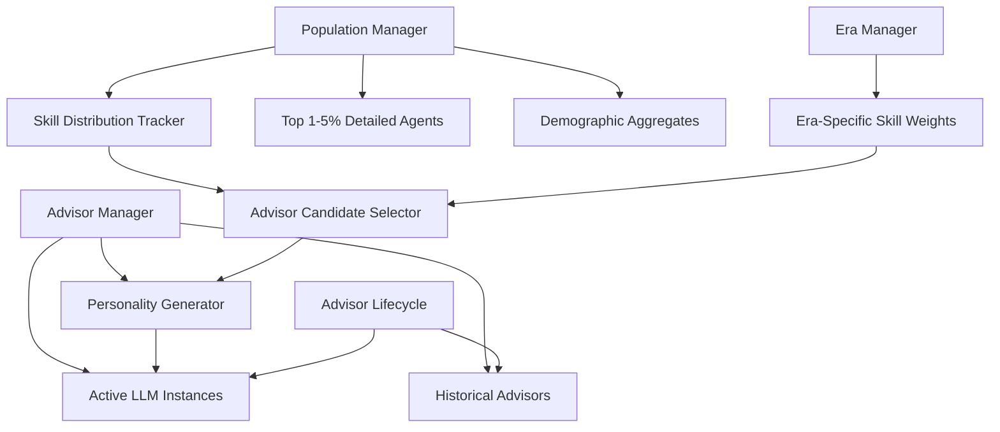

# Design Specification: Political Advisor System

## Architecture Overview

The Political Advisor System implements a revolutionary population-driven emergence model where LLM-powered advisors naturally arise from civilization development rather than appearing randomly. This system balances computational efficiency with narrative authenticity through selective detailed modeling of top-performing citizens.

### High-Level System Design



## Component Design

### Population Performance Curve System
The core innovation tracking population skill distributions and identifying natural leadership candidates.

**Population Modeling Architecture**:
```python
class PopulationManager:
    def __init__(self):
        # Detailed tracking for top performers
        self.agents = {}  # Top 1-5% with full personality profiles
        
        # Statistical population modeling
        self.demographics = {
            "total_population": 0,
            "age_distribution": {},
            "skill_averages": {},
            "cultural_trends": {}
        }
        
        # Era-weighted skill curves
        self.skill_distributions = {
            "military": SkillDistribution(),
            "economic": SkillDistribution(),
            "cultural": SkillDistribution(),
            "scientific": SkillDistribution()
        }
        
    def update_skill_distributions(self, era, technological_progress):
        """Update population skill curves based on era and development"""
        era_weights = EraSkillWeights.get_weights(era)
        
        for skill_domain in self.skill_distributions:
            distribution = self.skill_distributions[skill_domain]
            distribution.evolve_for_era(era_weights[skill_domain], technological_progress)
```

### Advisor Selection Algorithm
Sophisticated candidate selection using population performance analysis.

**Selection Process Architecture**:
```python
class AdvisorCandidateSelector:
    def __init__(self, population_manager, era_manager):
        self.population_manager = population_manager
        self.era_manager = era_manager
        self.selection_cache = {}
        
    def select_candidates(self, role, skill_requirements, era):
        """Select top advisor candidates from population"""
        # Get era-specific skill weightings
        era_weights = self.era_manager.get_skill_weights(era)
        
        # Rank all eligible agents
        candidates = []
        for agent_id, agent in self.population_manager.agents.items():
            if self._meets_basic_requirements(agent, role):
                score = self._calculate_advisor_score(
                    agent, 
                    skill_requirements, 
                    era_weights
                )
                candidates.append((agent_id, agent, score))
        
        # Return top 0.5-1% as potential advisors
        candidates.sort(key=lambda x: x[2], reverse=True)
        top_percentile = max(1, len(candidates) // 200)
        return candidates[:top_percentile]
        
    def _calculate_advisor_score(self, agent, requirements, era_weights):
        """Calculate weighted advisor suitability score"""
        base_score = 0
        
        # Era-appropriate skill evaluation
        for skill, importance in requirements.items():
            agent_skill = agent.skills.get(skill, 0)
            era_modifier = era_weights.get(skill, 1.0)
            base_score += agent_skill * importance * era_modifier
            
        # Experience and achievement bonuses
        experience_bonus = len(agent.achievements) * 0.1
        leadership_bonus = agent.traits.get('leadership', 0) * 0.2
        
        return base_score + experience_bonus + leadership_bonus
```

### LLM Personality Generation System
Dynamic personality creation based on citizen backgrounds and era context.

**Personality Generation Architecture**:
```python
class PersonalityGenerator:
    def __init__(self):
        self.era_templates = self._load_era_templates()
        self.achievement_patterns = self._load_achievement_patterns()
        self.cultural_contexts = self._load_cultural_contexts()
        
    def generate_advisor_personality(self, citizen, era, role):
        """Create comprehensive LLM personality from citizen data"""
        personality_prompt = self._build_personality_prompt(citizen, era, role)
        communication_style = self._determine_communication_style(citizen, era)
        knowledge_base = self._generate_knowledge_base(citizen, era, role)
        
        return AdvisorPersonality(
            prompt=personality_prompt,
            communication_style=communication_style,
            knowledge_base=knowledge_base,
            background_story=self._generate_background_story(citizen),
            era_context=era
        )
        
    def _build_personality_prompt(self, citizen, era, role):
        """Construct detailed personality prompt for LLM"""
        base_template = self.era_templates[era][role]
        
        prompt = f"""
        You are {citizen.name}, a {citizen.age}-year-old {role} advisor in the {era} era.
        
        BACKGROUND:
        {self._generate_background_story(citizen)}
        
        EXPERTISE AND ACHIEVEMENTS:
        Primary Skills: {', '.join(citizen.get_top_skills(5))}
        Major Achievements: {self._format_achievements(citizen.achievements)}
        Recognition Level: {citizen.get_recognition_level()}
        
        PERSONALITY TRAITS:
        {self._derive_personality_traits(citizen)}
        
        COMMUNICATION STYLE:
        {self._determine_communication_style(citizen, era)}
        
        VALUES AND BELIEFS:
        {self._generate_era_appropriate_values(citizen, era)}
        
        KNOWLEDGE CONTEXT:
        {self._generate_era_knowledge_context(era, role)}
        
        ADVISORY APPROACH:
        {self._generate_advisory_approach(citizen, role, era)}
        """
        
        return prompt
```

### Advisor Lifecycle Management
Comprehensive system for advisor aging, retirement, death, and replacement.

**Lifecycle Management Architecture**:
```python
class AdvisorLifecycleManager:
    def __init__(self, advisor_manager, population_manager):
        self.advisor_manager = advisor_manager
        self.population_manager = population_manager
        self.lifecycle_events = []
        
    def process_advisor_aging(self, game_year):
        """Handle natural aging and career progression"""
        for advisor_id, advisor in self.advisor_manager.active_advisors.items():
            # Calculate age-based effectiveness decline
            effectiveness = self._calculate_age_effectiveness(advisor, game_year)
            advisor.update_effectiveness(effectiveness)
            
            # Check for retirement conditions
            if self._should_retire(advisor, game_year):
                self._process_retirement(advisor_id, "natural_aging")
                
            # Check for death conditions
            elif self._check_death_probability(advisor, game_year):
                self._process_death(advisor_id, "natural_causes")
                
    def _calculate_age_effectiveness(self, advisor, current_year):
        """Calculate advisor effectiveness based on age and era"""
        age = current_year - advisor.birth_year
        era_life_expectancy = self._get_era_life_expectancy(advisor.era)
        
        # Peak effectiveness in middle years
        peak_age = era_life_expectancy * 0.6
        if age < peak_age:
            return min(1.0, age / peak_age)  # Rising effectiveness
        else:
            decline_rate = 0.02  # 2% per year past peak
            return max(0.3, 1.0 - (age - peak_age) * decline_rate)
            
    def handle_advisor_crisis(self, advisor_id, crisis_type):
        """Handle crisis-induced advisor departure"""
        if crisis_type == "scandal":
            self._process_scandal_departure(advisor_id)
        elif crisis_type == "assassination":
            self._process_violent_death(advisor_id)
        elif crisis_type == "burnout":
            self._process_burnout_retirement(advisor_id)
```

## Data Model

### Citizen Data Structure
Comprehensive citizen modeling supporting future advisor emergence.

```python
class Citizen:
    def __init__(self, birth_year, era):
        self.id = uuid4()
        self.birth_year = birth_year
        self.era_born = era
        
        # Core attributes
        self.name = NameGenerator.generate_era_appropriate_name(era)
        self.skills = {}  # Skill domain -> proficiency level
        self.traits = {}  # Personality and physical traits
        self.achievements = []  # List of accomplishments
        
        # Social connections
        self.relationships = {}  # Network of social connections
        self.faction_affiliations = []  # Political/cultural group memberships
        self.reputation = 0.5  # General population standing
        
        # Career progression
        self.occupation_history = []
        self.leadership_experience = []
        self.current_status = "citizen"  # citizen, agent, advisor
        
        # Era adaptation
        self.era_knowledge = {}  # Understanding of current era context
        self.cultural_adaptation = 1.0  # How well adapted to current era
        
    def calculate_advisor_potential(self, role, era):
        """Calculate potential for specific advisor role in given era"""
        role_skills = AdvisorRoleDefinitions.get_required_skills(role, era)
        potential_score = 0
        
        for skill, importance in role_skills.items():
            citizen_skill = self.skills.get(skill, 0)
            potential_score += citizen_skill * importance
            
        # Adjust for leadership experience and traits
        leadership_bonus = len(self.leadership_experience) * 0.1
        trait_bonus = self.traits.get('charisma', 0) * 0.2
        
        return potential_score + leadership_bonus + trait_bonus
```

### Advisor Personality Data
Complete personality modeling for LLM integration.

```python
class AdvisorPersonality:
    def __init__(self, citizen_id, role, era):
        self.citizen_id = citizen_id
        self.role = role
        self.era = era
        
        # LLM Integration
        self.personality_prompt = ""
        self.communication_style = {}
        self.knowledge_base = {}
        
        # Background Information
        self.background_story = ""
        self.major_achievements = []
        self.personal_motivations = []
        
        # Advisory Characteristics
        self.advisory_approach = ""  # How they provide advice
        self.decision_making_style = ""  # Analytical, intuitive, etc.
        self.risk_tolerance = 0.5  # Conservative to aggressive
        
        # Relationship Dynamics
        self.loyalty_factors = {}  # What affects their loyalty
        self.conflict_triggers = []  # What causes disagreements
        self.alliance_preferences = []  # Which advisors they work well with
        
        # Evolution Over Time
        self.experience_modifiers = {}  # How experiences change them
        self.aging_effects = {}  # How aging affects personality
        self.era_adaptation = {}  # How they adapt to era changes
```

## API Specification

### Population Management API
```python
class PopulationManager:
    def get_advisor_candidates(self, role: str, era: EraType, 
                              requirements: Dict[str, float]) -> List[Citizen]:
        """Get ranked list of advisor candidates from population"""
        
    def promote_citizen_to_advisor(self, citizen_id: str, role: str) -> AdvisorPersonality:
        """Convert citizen to active advisor with full personality"""
        
    def update_population_skills(self, era: EraType, technological_progress: float):
        """Update population skill distributions for era progression"""
        
    def get_population_statistics(self) -> PopulationStats:
        """Get current demographic and skill distribution statistics"""
```

### Advisor Management API
```python
class AdvisorManager:
    def create_advisor(self, citizen: Citizen, role: str, era: EraType) -> Advisor:
        """Create new advisor instance from citizen data"""
        
    def get_active_advisors(self) -> Dict[str, Advisor]:
        """Get all currently active advisor instances"""
        
    def process_advisor_advice(self, advisor_id: str, situation: str) -> AdviceResponse:
        """Get LLM-generated advice from specific advisor"""
        
    def handle_advisor_vacancy(self, role: str, replacement_urgency: float) -> List[Citizen]:
        """Handle advisor departure and present replacement candidates"""
```

### Personality Generation API
```python
class PersonalityGenerator:
    def generate_personality(self, citizen: Citizen, role: str, era: EraType) -> AdvisorPersonality:
        """Generate complete advisor personality from citizen background"""
        
    def update_personality_for_era(self, personality: AdvisorPersonality, new_era: EraType):
        """Update advisor personality for era transition"""
        
    def apply_experience_effects(self, personality: AdvisorPersonality, experiences: List[str]):
        """Modify personality based on advisor experiences"""
```

## Security Considerations

### LLM Resource Management
- **Instance Limits**: Maximum 8 active LLM instances to prevent resource exhaustion
- **Memory Management**: Automatic cleanup of inactive advisor personalities
- **Token Usage**: Monitoring and limits on LLM API usage

### Personality Authenticity
- **Era Validation**: Ensure advisor knowledge doesn't exceed era limitations
- **Consistency Checking**: Validate personality consistency across interactions
- **Background Verification**: Ensure generated backgrounds match citizen data

## Performance & Scalability

### Computational Efficiency
- **Lazy Loading**: Advisor personalities generated only when promoted
- **Caching**: Frequently accessed population data cached for performance
- **Background Processing**: Population skill evolution processed during turn transitions
- **Batched Updates**: Group population updates for efficiency

### Memory Optimization
- **Selective Detail**: Only top 1-5% of population tracked in detail
- **Statistical Modeling**: 95% of population handled through aggregates
- **Garbage Collection**: Automatic cleanup of unused advisor instances
- **Data Compression**: Compressed storage for historical advisor data

### Scalability Targets
- **Advisor Selection**: < 100ms for candidate identification
- **Personality Generation**: < 5 seconds for complete advisor creation
- **Population Updates**: < 10 seconds for era transition processing
- **Memory Usage**: < 500MB for complete population and advisor data

## Implementation Considerations

### Era-Specific Adaptations
Each era requires different skill weightings, cultural contexts, and advisor roles:
- **Ancient Era**: Focus on survival skills, tribal leadership, oral traditions
- **Classical Era**: Formal governance, military tactics, philosophical thinking
- **Medieval Era**: Feudal politics, religious influence, craft specialization
- **Future Eras**: Advanced technologies, AI integration, post-human considerations

### Cultural Authenticity
- **Historical Accuracy**: Era-appropriate knowledge and concerns for advisors
- **Cultural Variation**: Different civilization types produce different advisor styles
- **Language Evolution**: Communication styles that evolve with technological advancement
- **Value Systems**: Era-appropriate moral and ethical frameworks

### Integration Points
- **Crisis System**: Advisors respond to and are affected by political crises
- **Population Evolution**: Advisor emergence reflects long-term population development
- **UI System**: Advisor personalities expressed through 3D avatar interactions
- **Save System**: Complete advisor state persistence across game sessions
