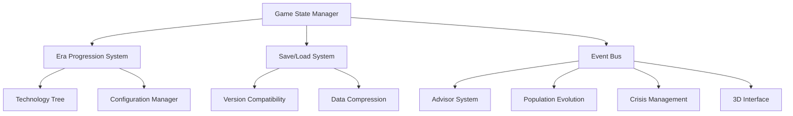

# Design Specification: Core Game Architecture

## Architecture Overview

The core game architecture provides the foundational 4X strategy framework supporting era progression through ten distinct technological and cultural eras. The system uses a modular, event-driven architecture that enables seamless integration of political advisors, population evolution, crisis management, and 3D visualization systems.

### High-Level System Design



## Component Design

### Era Progression System
The era system manages technological and cultural advancement through ten distinct eras, each with unique capabilities, building types, and victory conditions.

**Core Components**:
- **Era Definition Manager**: Loads era configurations from JSON files
- **Transition Controller**: Manages era advancement requirements and triggers
- **Technology Tree**: Tracks research progress and unlocks
- **Era Event Dispatcher**: Notifies other systems of era changes

**Era Configuration Schema**:
```json
{
  "era_id": "ancient",
  "display_name": "Ancient Era",
  "time_period": {"start": -4000, "end": -500},
  "prerequisites": {
    "technologies": ["agriculture", "animal_husbandry"],
    "population_threshold": 50000,
    "cultural_development": 0.3
  },
  "unlocks": {
    "buildings": ["granary", "barracks", "marketplace"],
    "units": ["warrior", "settler", "worker"],
    "technologies": ["bronze_working", "pottery", "archery"]
  },
  "victory_conditions": ["conquest", "cultural"],
  "advisor_roles": {
    "military": {"skills": ["hunting", "warfare"], "weight": 0.8},
    "economic": {"skills": ["gathering", "trade"], "weight": 0.6},
    "cultural": {"skills": ["storytelling", "customs"], "weight": 0.7}
  }
}
```

### Save/Load System
Robust save system supporting backward compatibility and efficient data serialization.

**Architecture Features**:
- **Version Migration**: Automatic upgrade of save files from previous versions
- **Compression**: LZ4 compression for reduced file sizes
- **Integrity Checking**: SHA-256 checksums to prevent corruption
- **Incremental Saves**: Delta compression for autosave efficiency

**Save Data Structure**:
```python
class SaveGameData:
    def __init__(self):
        self.version = "1.0.0"
        self.timestamp = datetime.now()
        self.game_metadata = GameMetadata()
        self.game_state = {}
        self.system_states = {}
        
    def serialize(self):
        return {
            "header": {
                "version": self.version,
                "timestamp": self.timestamp.isoformat(),
                "checksum": self._calculate_checksum()
            },
            "data": {
                "game_state": self.game_state,
                "systems": self.system_states
            }
        }
```

### Event Bus Architecture
Decoupled communication system enabling loose coupling between game systems.

**Event Types**:
- **Era Events**: Era transitions, technology unlocks
- **Population Events**: Demographic changes, advisor emergence
- **Crisis Events**: Political crises, investigation updates
- **UI Events**: Interface updates, user interactions

**Event Bus Implementation**:
```python
class GameEventBus:
    def __init__(self):
        self.subscribers = defaultdict(list)
        self.event_queue = Queue()
        self.event_history = []
        
    def subscribe(self, event_type, handler, priority=0):
        self.subscribers[event_type].append((handler, priority))
        self.subscribers[event_type].sort(key=lambda x: x[1], reverse=True)
        
    def publish(self, event_type, data, immediate=False):
        event = GameEvent(event_type, data, datetime.now())
        
        if immediate:
            self._process_event(event)
        else:
            self.event_queue.put(event)
            
    def process_queued_events(self):
        while not self.event_queue.empty():
            event = self.event_queue.get()
            self._process_event(event)
```

## Data Model

### Core Game State
Central data structure maintaining complete game state across all systems.

```python
class GameState:
    def __init__(self):
        # Core progression tracking
        self.current_era = EraType.ANCIENT
        self.turn_number = 0
        self.game_year = -4000
        
        # Map and civilization data
        self.world_map = HexWorldMap()
        self.civilizations = {}
        self.player_civilization_id = None
        
        # System managers
        self.era_manager = EraManager(self)
        self.technology_manager = TechnologyManager(self)
        self.event_bus = GameEventBus()
        
        # External system hooks
        self.population_manager = None  # Injected by population system
        self.advisor_manager = None     # Injected by advisor system
        self.crisis_manager = None      # Injected by crisis system
        
    def advance_turn(self):
        self.turn_number += 1
        self.game_year += self._calculate_year_increment()
        
        # Notify all systems of turn advancement
        self.event_bus.publish("turn_advanced", {
            "turn": self.turn_number,
            "year": self.game_year,
            "era": self.current_era
        })
```

### Technology Tree Schema
Hierarchical technology system supporting era-based progression.

```python
class Technology:
    def __init__(self, tech_id, era, prerequisites, effects):
        self.tech_id = tech_id
        self.era = era
        self.prerequisites = prerequisites
        self.research_cost = 0
        self.effects = effects
        
    def can_research(self, completed_techs, current_era):
        # Check era requirements
        if self.era.value > current_era.value:
            return False
            
        # Check prerequisite technologies
        for prereq in self.prerequisites:
            if prereq not in completed_techs:
                return False
                
        return True

class TechnologyTree:
    def __init__(self):
        self.technologies = {}
        self.completed_technologies = set()
        self.available_technologies = set()
        
    def update_available_technologies(self, current_era):
        self.available_technologies.clear()
        for tech_id, tech in self.technologies.items():
            if tech.can_research(self.completed_technologies, current_era):
                self.available_technologies.add(tech_id)
```

## API Specification

### Era Management API
```python
class EraManager:
    def get_current_era(self) -> Era:
        """Return current civilization era"""
        
    def can_advance_era(self, target_era: EraType) -> bool:
        """Check if civilization meets requirements for era advancement"""
        
    def advance_era(self, target_era: EraType) -> EraTransitionResult:
        """Advance to new era and notify all systems"""
        
    def get_era_unlocks(self, era: EraType) -> EraUnlocks:
        """Get buildings, units, technologies unlocked by era"""
        
    def get_transition_requirements(self, target_era: EraType) -> Requirements:
        """Get requirements needed to advance to target era"""
```

### Save System API
```python
class SaveGameManager:
    def save_game(self, game_state: GameState, filename: str) -> SaveResult:
        """Save complete game state to file"""
        
    def load_game(self, filename: str) -> GameState:
        """Load game state from file with version migration"""
        
    def create_autosave(self, game_state: GameState) -> SaveResult:
        """Create compressed autosave with incremental data"""
        
    def get_save_metadata(self, filename: str) -> SaveMetadata:
        """Get save file information without loading full game"""
```

### Event System API
```python
class GameEventBus:
    def subscribe(self, event_type: str, handler: Callable, priority: int = 0):
        """Register event handler with optional priority"""
        
    def unsubscribe(self, event_type: str, handler: Callable):
        """Remove event handler"""
        
    def publish(self, event_type: str, data: dict, immediate: bool = False):
        """Publish event to all subscribers"""
        
    def get_event_history(self, event_type: str = None) -> List[GameEvent]:
        """Get history of published events"""
```

## Security Considerations

### Save File Security
- **Checksum Validation**: Prevent save file tampering
- **Version Verification**: Ensure save compatibility
- **Backup System**: Automatic backup of corrupted saves

### Configuration Security
- **Input Validation**: Sanitize all configuration data
- **Schema Validation**: Enforce JSON schema compliance
- **Default Fallbacks**: Handle missing or invalid configuration

## Performance & Scalability

### Memory Management
- **Lazy Loading**: Load era data only when needed
- **Garbage Collection**: Automatic cleanup of unused era assets
- **Memory Pooling**: Reuse objects for better performance

### Processing Optimization
- **Background Processing**: Era transitions processed in background threads
- **Batch Updates**: Group system notifications for efficiency
- **Caching**: Cache frequently accessed era and technology data

### Scalability Targets
- **Turn Processing**: < 30 seconds for late-game civilizations
- **Save/Load Operations**: < 10 seconds for typical saves
- **Memory Usage**: < 2GB RAM for full game state
- **Era Transitions**: < 5 seconds for complete system updates

## Implementation Considerations

### Configuration-Driven Design
All game balance and era definitions stored in external JSON files, enabling:
- Easy balance modifications without code changes
- Mod support through configuration replacement
- A/B testing of different era progression models

### Extensibility Framework
Architecture designed for easy addition of new systems:
- Plugin-style system registration
- Event-driven system communication
- Modular component design

### Error Handling
Comprehensive error handling with graceful degradation:
- Save corruption recovery
- Configuration error handling
- Network disconnection resilience
- Memory pressure adaptation
