# Design Specification: Crisis Management and Events System

## Architecture Overview

The Crisis Management and Events System creates a sophisticated, era-spanning crisis framework that presents authentic challenges from Ancient tribal disputes to Machine AI consciousness conflicts. The system features complex investigation mechanics, information warfare evolution, and long-term consequences that shape civilization development.

### High-Level System Design

```mermaid
graph TB
    CrisisEngine[Crisis Management Engine] --> CrisisGenerator[Crisis Event Generator]
    CrisisEngine --> InvestigationSystem[Investigation System]
    CrisisEngine --> InformationWarfare[Information Warfare Manager]
    
    CrisisGenerator --> EraSpecificCrises[Era-Specific Crisis Types]
    CrisisGenerator --> ConspiracyNetworks[Conspiracy Network Generator]
    CrisisGenerator --> DynamicTriggers[Dynamic Crisis Triggers]
    
    InvestigationSystem --> EvidenceEngine[Evidence Generation Engine]
    InvestigationSystem --> EraTools[Era-Appropriate Investigation Tools]
    InvestigationSystem --> NetworkAnalysis[Conspiracy Network Analysis]
    
    InformationWarfare --> InfluenceCampaigns[Influence Campaign System]
    InformationWarfare --> CounterIntelligence[Counter-Intelligence System]
    InformationWarfare --> PopulationBeliefs[Population Belief Tracking]
    
    ConsequenceEngine[Long-Term Consequence Engine] --> CivilizationImpact[Civilization Development Impact]
    ConsequenceEngine --> AdvisorEffects[Advisor Relationship Effects]
    ConsequenceEngine --> PopulationChanges[Population Evolution Effects]
    
    EraAdaptation[Era Adaptation System] --> EraSpecificCrises
    EraAdaptation --> EraTools
    EraAdaptation --> InfluenceCampaigns
```



## Component Design

### Era-Specific Crisis Generation System
Dynamic crisis generation that scales complexity and authenticity with civilization development.

**Crisis Generation Architecture**:
```python
class CrisisGenerator:
    def __init__(self):
        self.era_crisis_templates = self._load_era_crisis_templates()
        self.complexity_modifiers = self._initialize_complexity_modifiers()
        self.trigger_conditions = self._setup_trigger_conditions()
        self.population_manager = None  # Injected dependency
        
    def generate_era_appropriate_crisis(self, era, civilization_state, trigger_event=None):
        """Generate crisis matching era complexity and civilization development"""
        # Determine crisis category based on era and triggers
        crisis_category = self._select_crisis_category(era, civilization_state, trigger_event)
        
        # Get era-specific crisis template
        template = self.era_crisis_templates[era][crisis_category]
        
        # Calculate complexity level based on civilization sophistication
        complexity_level = self._calculate_crisis_complexity(era, civilization_state)
        
        # Generate crisis instance
        crisis = self._instantiate_crisis_from_template(
            template, 
            complexity_level, 
            civilization_state
        )
        
        # Add era-specific participants and motivations
        self._populate_crisis_participants(crisis, era, civilization_state)
        
        # Generate investigation opportunities
        self._create_investigation_framework(crisis, era)
        
        # Set up resolution pathways
        self._establish_resolution_options(crisis, era, civilization_state)
        
        return crisis
        
    def _select_crisis_category(self, era, civilization_state, trigger_event):
        """Select appropriate crisis type for era and situation"""
        era_categories = {
            'ancient': ['tribal_conflict', 'resource_scarcity', 'succession_dispute', 'natural_disaster'],
            'classical': ['barbarian_invasion', 'civil_unrest', 'trade_disruption', 'religious_conflict'],
            'medieval': ['court_intrigue', 'feudal_rebellion', 'plague_outbreak', 'religious_schism'],
            'renaissance': ['cultural_movement', 'exploration_crisis', 'banking_crisis', 'reformation'],
            'industrial': ['labor_conflict', 'industrial_espionage', 'resource_war', 'urbanization_crisis'],
            'modern': ['global_conflict', 'economic_crash', 'ideological_movement', 'media_manipulation'],
            'atomic': ['nuclear_diplomacy', 'cold_war_tension', 'proxy_conflict', 'technology_race'],
            'information': ['cyber_warfare', 'information_conflict', 'global_terrorism', 'digital_rights'],
            'ai': ['ai_consciousness', 'algorithmic_bias', 'technological_unemployment', 'privacy_crisis'],
            'machine_ai': ['post_human_governance', 'ai_rights_conflict', 'consciousness_war', 'reality_perception']
        }
        
        available_categories = era_categories[era]
        
        # Weight categories based on civilization state and triggers
        category_weights = self._calculate_category_weights(
            available_categories, 
            civilization_state, 
            trigger_event
        )
        
        return self._weighted_random_selection(available_categories, category_weights)

class CrisisEvent:
    def __init__(self, crisis_type, era, complexity_level):
        self.id = uuid4()
        self.crisis_type = crisis_type
        self.era = era
        self.complexity_level = complexity_level
        self.status = "emerging"
        
        # Participants and network
        self.participants = {}
        self.conspiracy_network = None
        self.key_figures = []
        
        # Investigation state
        self.investigation_state = InvestigationState()
        self.evidence_network = EvidenceNetwork()
        self.discovered_connections = set()
        
        # Resolution options
        self.resolution_options = []
        self.resolution_deadlines = {}
        self.escalation_triggers = []
        
        # Consequences and effects
        self.immediate_effects = {}
        self.long_term_consequences = []
        self.civilization_impacts = {}
        
    def advance_crisis_state(self, player_actions, time_elapsed):
        """Advance crisis based on player actions and time passage"""
        # Update investigation state
        if player_actions.get('investigation'):
            self.investigation_state.process_investigation_actions(player_actions['investigation'])
            
        # Check for escalation triggers
        for trigger in self.escalation_triggers:
            if trigger.check_conditions(player_actions, time_elapsed, self):
                self._escalate_crisis(trigger)
                
        # Update participant states
        for participant_id, participant in self.participants.items():
            participant.update_state(player_actions, time_elapsed, self)
            
        # Check resolution conditions
        self._check_resolution_conditions(player_actions)
        
    def get_available_actions(self, era, advisor_capabilities):
        """Get actions available to player based on era and advisor capabilities"""
        base_actions = self.resolution_options.copy()
        
        # Add investigation actions if appropriate
        if self.investigation_state.is_active():
            investigation_actions = self._get_era_investigation_actions(era, advisor_capabilities)
            base_actions.extend(investigation_actions)
            
        # Add information warfare actions
        if era in ['modern', 'atomic', 'information', 'ai', 'machine_ai']:
            info_warfare_actions = self._get_information_warfare_actions(era, advisor_capabilities)
            base_actions.extend(info_warfare_actions)
            
        return base_actions
```

### Investigation System Architecture
Sophisticated investigation mechanics with era-appropriate tools and evidence gathering.

**Investigation Framework**:
```python
class InvestigationSystem:
    def __init__(self):
        self.era_tools = self._initialize_era_investigation_tools()
        self.evidence_types = self._setup_evidence_type_system()
        self.investigation_methods = self._create_investigation_methods()
        
    def start_investigation(self, crisis_id, investigation_type, era, available_advisors):
        """Initialize investigation with era-appropriate tools and methods"""
        investigation = Investigation(
            crisis_id=crisis_id,
            investigation_type=investigation_type,
            era=era
        )
        
        # Assign era-appropriate tools
        investigation.available_tools = self.era_tools[era]
        
        # Generate evidence network based on crisis complexity
        crisis = CrisisManager.get_crisis(crisis_id)
        investigation.evidence_network = self._generate_evidence_network(crisis, era)
        
        # Set up investigation parameters
        investigation.max_investigation_time = self._calculate_max_investigation_time(era, crisis)
        investigation.evidence_decay_rate = self._get_evidence_decay_rate(era)
        investigation.advisor_effectiveness = self._calculate_advisor_effectiveness(
            available_advisors, 
            investigation_type, 
            era
        )
        
        return investigation
        
    def process_investigation_action(self, investigation_id, action_type, target, advisor_id):
        """Process specific investigation action and reveal evidence"""
        investigation = self.active_investigations[investigation_id]
        advisor = AdvisorManager.get_advisor(advisor_id)
        
        # Check if action is available in current era
        if not self._is_action_available_in_era(action_type, investigation.era):
            return InvestigationResult.ERA_INAPPROPRIATE
            
        # Calculate action effectiveness
        base_effectiveness = advisor.get_investigation_skill(action_type)
        era_modifier = self.era_tools[investigation.era].get_tool_effectiveness(action_type)
        target_difficulty = investigation.evidence_network.get_target_difficulty(target)
        
        effectiveness = base_effectiveness * era_modifier / target_difficulty
        
        # Process action and reveal evidence
        evidence_revealed = investigation.process_investigation_action(
            action_type, 
            target, 
            effectiveness
        )
        
        # Update conspiracy network visibility
        if evidence_revealed:
            investigation.update_network_visibility(evidence_revealed)
            
            # Check for breakthrough discoveries
            breakthrough = self._check_for_investigation_breakthrough(investigation)
            if breakthrough:
                return InvestigationResult.BREAKTHROUGH(evidence_revealed, breakthrough)
                
        return InvestigationResult.SUCCESS(evidence_revealed)

class ConspiracyNetwork:
    def __init__(self, complexity_level, era, crisis_context):
        self.complexity_level = complexity_level
        self.era = era
        self.crisis_context = crisis_context
        
        # Network structure
        self.participants = {}
        self.connections = {}
        self.hierarchy = {}
        self.communication_channels = {}
        
        # Hidden information
        self.true_motivations = {}
        self.secret_relationships = {}
        self.hidden_resources = {}
        
        # Evidence trail
        self.evidence_nodes = {}
        self.evidence_connections = {}
        self.red_herrings = {}
        
    def generate_conspiracy_network(self, population_manager):
        """Create realistic conspiracy network appropriate to era and crisis"""
        # Select participants from population
        potential_participants = population_manager.get_conspirator_candidates(
            self.era, 
            self.crisis_context,
            self.complexity_level
        )
        
        # Create network structure
        network_structure = self._generate_network_structure(
            len(potential_participants),
            self.complexity_level,
            self.era
        )
        
        # Assign roles and relationships
        for participant_data in potential_participants:
            participant = ConspiracyParticipant(participant_data, self.era)
            
            # Assign role in conspiracy
            role = self._assign_conspiracy_role(participant, network_structure)
            participant.conspiracy_role = role
            
            # Generate motivation
            motivation = self._generate_participant_motivation(
                participant, 
                self.crisis_context, 
                self.era
            )
            participant.motivation = motivation
            
            # Establish connections
            connections = self._establish_participant_connections(
                participant,
                network_structure,
                self.participants
            )
            
            self.participants[participant.id] = participant
            self.connections[participant.id] = connections
            
        # Generate evidence trail
        self._generate_evidence_trail()
        
        # Add red herrings and false leads
        self._add_investigation_complexity()
        
    def _generate_evidence_trail(self):
        """Create evidence network that investigators can discover"""
        evidence_types_by_era = {
            'ancient': ['witness_testimony', 'physical_evidence', 'tribal_symbols'],
            'classical': ['written_documents', 'witness_testimony', 'physical_evidence', 'messenger_interceptions'],
            'medieval': ['manuscripts', 'heraldic_evidence', 'messenger_interceptions', 'witness_testimony'],
            'renaissance': ['printed_documents', 'artistic_clues', 'financial_records', 'correspondence'],
            'industrial': ['telegrams', 'newspaper_clues', 'financial_records', 'industrial_evidence'],
            'modern': ['phone_records', 'financial_transactions', 'documentary_evidence', 'surveillance'],
            'atomic': ['radio_intercepts', 'classified_documents', 'surveillance_photos', 'defector_testimony'],
            'information': ['digital_evidence', 'communication_metadata', 'financial_digital_trails', 'cyber_forensics'],
            'ai': ['algorithm_analysis', 'data_pattern_recognition', 'ai_behavior_analysis', 'digital_consciousness_traces'],
            'machine_ai': ['consciousness_patterns', 'quantum_state_analysis', 'reality_perception_artifacts', 'ai_memory_fragments']
        }
        
        available_evidence_types = evidence_types_by_era[self.era]
        
        # Create evidence nodes for each connection
        for participant_id, connections in self.connections.items():
            for connected_id in connections:
                evidence_type = random.choice(available_evidence_types)
                evidence_node = EvidenceNode(
                    evidence_type=evidence_type,
                    participants=[participant_id, connected_id],
                    era=self.era,
                    difficulty=self._calculate_evidence_difficulty(evidence_type, self.era)
                )
                
                self.evidence_nodes[evidence_node.id] = evidence_node
```

### Information Warfare System
Era-spanning information warfare mechanics that evolve from oral traditions to AI-mediated consciousness manipulation.

**Information Warfare Architecture**:
```python
class InformationWarfareManager:
    def __init__(self):
        self.era_capabilities = self._initialize_era_capabilities()
        self.influence_methods = self._setup_influence_methods()
        self.population_belief_tracker = PopulationBeliefTracker()
        self.counter_intelligence = CounterIntelligenceSystem()
        
    def launch_influence_campaign(self, era, target_population, message, resources, advisor_id):
        """Launch information warfare campaign with era-appropriate methods"""
        advisor = AdvisorManager.get_advisor(advisor_id)
        campaign_tools = self.era_capabilities[era]
        
        # Create influence campaign
        campaign = InfluenceCampaign(
            era=era,
            target=target_population,
            message=message,
            tools=campaign_tools,
            resources=resources,
            advisor=advisor
        )
        
        # Calculate campaign effectiveness
        base_effectiveness = advisor.get_influence_skill()
        era_multiplier = campaign_tools.get_effectiveness_multiplier()
        resource_modifier = self._calculate_resource_effectiveness(resources, era)
        message_resonance = self._calculate_message_resonance(message, target_population, era)
        
        total_effectiveness = (base_effectiveness * era_multiplier * 
                             resource_modifier * message_resonance)
        
        # Launch campaign
        campaign_result = campaign.execute(total_effectiveness)
        
        # Apply population belief changes
        belief_changes = self._apply_influence_to_population_beliefs(
            campaign_result,
            target_population,
            era
        )
        
        # Register campaign for counter-intelligence detection
        self.active_campaigns[campaign.id] = campaign
        
        return InfluenceCampaignResult(campaign_result, belief_changes)
        
    def _initialize_era_capabilities(self):
        """Initialize information warfare capabilities for each era"""
        return {
            'ancient': InformationCapabilities(
                methods=['oral_storytelling', 'tribal_customs', 'ritual_practices'],
                reach='local_tribe',
                persistence='generational',
                effectiveness_base=0.3,
                counter_difficulty=0.8  # Hard to counter oral traditions
            ),
            'classical': InformationCapabilities(
                methods=['written_proclamations', 'public_speeches', 'artistic_propaganda', 'religious_influence'],
                reach='city_state',
                persistence='decades',
                effectiveness_base=0.4,
                counter_difficulty=0.6
            ),
            'medieval': InformationCapabilities(
                methods=['religious_sermons', 'illuminated_manuscripts', 'heraldic_symbols', 'troubadour_songs'],
                reach='regional',
                persistence='centuries',
                effectiveness_base=0.5,
                counter_difficulty=0.7
            ),
            'renaissance': InformationCapabilities(
                methods=['printing_press', 'artistic_patronage', 'humanist_education', 'exploration_narratives'],
                reach='continental',
                persistence='permanent',
                effectiveness_base=0.6,
                counter_difficulty=0.5
            ),
            'industrial': InformationCapabilities(
                methods=['mass_newspapers', 'telegraph_networks', 'public_education', 'industrial_propaganda'],
                reach='national',
                persistence='permanent',
                effectiveness_base=0.7,
                counter_difficulty=0.4
            ),
            'modern': InformationCapabilities(
                methods=['radio_broadcasting', 'television', 'cinema', 'mass_education'],
                reach='global',
                persistence='permanent',
                effectiveness_base=0.8,
                counter_difficulty=0.3
            ),
            'atomic': InformationCapabilities(
                methods=['television_propaganda', 'radio_free_broadcasts', 'cultural_exchanges', 'space_program_prestige'],
                reach='global',
                persistence='permanent',
                effectiveness_base=0.8,
                counter_difficulty=0.3
            ),
            'information': InformationCapabilities(
                methods=['internet_propaganda', 'social_media', 'search_algorithm_manipulation', 'meme_warfare'],
                reach='global_instant',
                persistence='permanent_searchable',
                effectiveness_base=0.9,
                counter_difficulty=0.2
            ),
            'ai': InformationCapabilities(
                methods=['ai_generated_content', 'personalized_propaganda', 'algorithmic_bias', 'deepfake_technology'],
                reach='individualized_global',
                persistence='permanent_adaptable',
                effectiveness_base=0.95,
                counter_difficulty=0.1
            ),
            'machine_ai': InformationCapabilities(
                methods=['consciousness_manipulation', 'reality_perception_alteration', 'quantum_information_states', 'direct_neural_interface'],
                reach='consciousness_level',
                persistence='reality_alteration',
                effectiveness_base=1.0,
                counter_difficulty=0.05
            )
        }

class PopulationBeliefTracker:
    def __init__(self):
        self.belief_dimensions = {
            'political_authority': BeliefDimension(default_value=0.5),
            'economic_system': BeliefDimension(default_value=0.5),
            'social_hierarchy': BeliefDimension(default_value=0.5),
            'religious_values': BeliefDimension(default_value=0.5),
            'technological_progress': BeliefDimension(default_value=0.5),
            'environmental_concern': BeliefDimension(default_value=0.5)
        }
        
        self.cultural_momentum = {}
        self.generational_differences = {}
        
    def apply_influence_campaign_effects(self, campaign_result, target_population):
        """Apply influence campaign effects to population beliefs"""
        belief_changes = {}
        
        for belief_category, target_shift in campaign_result.targeted_beliefs.items():
            current_belief = self.belief_dimensions[belief_category].current_value
            
            # Calculate resistance to change
            cultural_inertia = self._calculate_cultural_inertia(belief_category, target_population)
            
            # Calculate influence effectiveness
            influence_strength = campaign_result.effectiveness * target_shift
            
            # Apply generational differences
            generational_modifier = self._calculate_generational_receptivity(
                belief_category, 
                campaign_result.era
            )
            
            # Calculate net belief shift
            net_influence = influence_strength * generational_modifier * (1.0 - cultural_inertia)
            
            # Apply belief change with momentum effects
            new_belief_value = self._apply_belief_change_with_momentum(
                belief_category,
                current_belief,
                net_influence
            )
            
            self.belief_dimensions[belief_category].update_value(new_belief_value)
            
            belief_changes[belief_category] = {
                'old_value': current_belief,
                'new_value': new_belief_value,
                'change_amount': net_influence,
                'factors': {
                    'cultural_inertia': cultural_inertia,
                    'generational_modifier': generational_modifier,
                    'influence_strength': influence_strength
                }
            }
            
        return PopulationBeliefChangeReport(belief_changes)
```

## Data Model

### Crisis State Management
Comprehensive data structures for tracking complex crisis evolution and player interactions.

```python
class CrisisState:
    def __init__(self, crisis_id, crisis_type, era):
        self.crisis_id = crisis_id
        self.crisis_type = crisis_type
        self.era = era
        self.creation_timestamp = datetime.now()
        
        # Crisis progression
        self.current_phase = "emerging"
        self.escalation_level = 0.0
        self.resolution_urgency = 0.0
        self.time_pressure = TimePressureTracker()
        
        # Participant network
        self.network_structure = NetworkStructure()
        self.participant_states = {}
        self.relationship_dynamics = {}
        
        # Player interaction history
        self.player_actions = []
        self.investigation_progress = InvestigationProgress()
        self.decision_consequences = []
        
        # Long-term impact tracking
        self.civilization_effects = {}
        self.advisor_relationship_impacts = {}
        self.population_consequences = {}
        
    def calculate_crisis_trajectory(self, player_actions, time_elapsed):
        """Calculate how crisis evolves based on player actions and time"""
        trajectory = CrisisTrajectory()
        
        # Analyze player response effectiveness
        response_effectiveness = self._analyze_response_effectiveness(player_actions)
        
        # Calculate escalation or de-escalation
        escalation_factors = self._calculate_escalation_factors(
            player_actions, 
            time_elapsed, 
            response_effectiveness
        )
        
        # Update crisis state
        new_escalation_level = self._apply_escalation_factors(escalation_factors)
        new_phase = self._determine_crisis_phase(new_escalation_level)
        
        # Calculate consequence trajectory
        consequence_trajectory = self._project_consequence_trajectory(
            new_escalation_level,
            player_actions,
            self.era
        )
        
        trajectory.update(new_escalation_level, new_phase, consequence_trajectory)
        return trajectory

class ConspiracyParticipant:
    def __init__(self, citizen_data, era):
        self.citizen_id = citizen_data.id
        self.name = citizen_data.name
        self.era = era
        
        # Conspiracy role
        self.conspiracy_role = None  # Leader, Lieutenant, Follower, Informant
        self.motivation = None
        self.commitment_level = 0.0
        self.risk_tolerance = 0.0
        
        # Capabilities and resources
        self.skills = citizen_data.skills.copy()
        self.resources = {}
        self.connections = []
        
        # Behavior patterns
        self.communication_style = None
        self.decision_making_pattern = None
        self.stress_response = None
        
        # Discovery vulnerability
        self.exposure_risk = 0.0
        self.evidence_trail_strength = 0.0
        self.counter_intelligence_awareness = 0.0
        
    def calculate_behavior_under_pressure(self, investigation_pressure, time_pressure):
        """Calculate how participant behaves under investigation pressure"""
        stress_level = investigation_pressure + time_pressure
        
        # Behavior modification based on stress and personality
        if stress_level > self.stress_threshold:
            if self.stress_response == "aggressive":
                return BehaviorModification.ESCALATE_ACTIONS
            elif self.stress_response == "cautious":
                return BehaviorModification.REDUCE_ACTIVITY
            elif self.stress_response == "erratic":
                return BehaviorModification.UNPREDICTABLE_ACTIONS
            else:
                return BehaviorModification.ATTEMPT_ESCAPE
        else:
            return BehaviorModification.CONTINUE_NORMAL_OPERATIONS
```

### Information Warfare State
Complex tracking of influence campaigns, population beliefs, and counter-intelligence activities.

```python
class InfluenceCampaignState:
    def __init__(self, campaign_id, era, target, message):
        self.campaign_id = campaign_id
        self.era = era
        self.target = target
        self.message = message
        self.launch_timestamp = datetime.now()
        
        # Campaign parameters
        self.methods_used = []
        self.resource_investment = {}
        self.advisor_involvement = None
        
        # Effectiveness tracking
        self.reach_metrics = ReachMetrics()
        self.penetration_rate = 0.0
        self.belief_shift_achieved = {}
        self.resistance_encountered = {}
        
        # Counter-intelligence detection
        self.detection_risk = 0.0
        self.counter_campaigns = []
        self.exposure_events = []
        
        # Long-term persistence
        self.cultural_momentum = 0.0
        self.generational_transmission = 0.0
        self.institutional_adoption = 0.0
        
    def calculate_campaign_decay(self, time_elapsed, counter_efforts):
        """Calculate how campaign effectiveness decays over time"""
        base_decay_rate = self._get_era_decay_rate(self.era)
        
        # Counter-effort amplification of decay
        counter_amplification = sum(effort.effectiveness for effort in counter_efforts)
        
        # Cultural momentum resistance to decay
        momentum_resistance = self.cultural_momentum
        
        # Calculate net decay
        net_decay_rate = base_decay_rate * (1.0 + counter_amplification) * (1.0 - momentum_resistance)
        
        new_effectiveness = max(0.0, self.current_effectiveness - (net_decay_rate * time_elapsed))
        
        return CampaignDecayResult(new_effectiveness, net_decay_rate)
```

## API Specification

### Crisis Management API
```python
class CrisisManager:
    def generate_crisis(self, era: EraType, trigger_conditions: Dict) -> CrisisEvent:
        """Generate era-appropriate crisis based on current conditions"""
        
    def advance_crisis_state(self, crisis_id: str, player_actions: List[Action], 
                            time_elapsed: int) -> CrisisStateUpdate:
        """Advance crisis based on player actions and time passage"""
        
    def get_available_actions(self, crisis_id: str, advisor_capabilities: Dict) -> List[Action]:
        """Get actions available for crisis based on era and advisors"""
        
    def resolve_crisis(self, crisis_id: str, resolution_action: Action) -> CrisisResolution:
        """Apply crisis resolution and calculate consequences"""
```

### Investigation System API
```python
class InvestigationManager:
    def start_investigation(self, crisis_id: str, investigation_type: str, 
                           era: EraType, advisor_id: str) -> Investigation:
        """Start investigation with era-appropriate tools"""
        
    def process_investigation_action(self, investigation_id: str, action: InvestigationAction) -> InvestigationResult:
        """Process investigation action and reveal evidence"""
        
    def get_conspiracy_network_state(self, investigation_id: str) -> NetworkState:
        """Get current understanding of conspiracy network"""
        
    def calculate_investigation_breakthrough_probability(self, investigation_id: str) -> float:
        """Calculate probability of major investigation breakthrough"""
```

### Information Warfare API
```python
class InformationWarfareManager:
    def launch_influence_campaign(self, campaign_params: CampaignParameters) -> CampaignResult:
        """Launch information warfare campaign"""
        
    def get_population_belief_state(self, population_id: str) -> PopulationBeliefs:
        """Get current population belief state"""
        
    def detect_foreign_influence(self, counter_intelligence_level: float) -> List[DetectedCampaign]:
        """Detect foreign influence campaigns"""
        
    def calculate_belief_change_projection(self, campaign: InfluenceCampaign, 
                                         time_horizon: int) -> BeliefProjection:
        """Project long-term belief changes from campaign"""
```

## Security Considerations

### Crisis Data Integrity
- **State Validation**: Ensure crisis states remain logically consistent
- **Action Validation**: Verify player actions are appropriate for era and situation
- **Consequence Calculation**: Prevent exploitation of crisis resolution mechanics

### Investigation Security
- **Evidence Tampering**: Prevent manipulation of investigation evidence
- **Network Consistency**: Ensure conspiracy networks remain logically coherent
- **Tool Availability**: Enforce era-appropriate investigation tool restrictions

## Performance & Scalability

### Crisis Processing Efficiency
- **Background Processing**: Crisis evolution calculated during turn transitions
- **State Caching**: Cache frequently accessed crisis states
- **Lazy Loading**: Load detailed crisis information only when needed
- **Batch Processing**: Group crisis updates for efficiency

### Investigation Optimization
- **Evidence Indexing**: Efficient searching and filtering of evidence networks
- **Network Analysis**: Optimized algorithms for conspiracy network analysis
- **State Compression**: Compress investigation history for memory efficiency
- **Progressive Disclosure**: Reveal investigation complexity gradually

### Scalability Targets
- **Crisis Generation**: < 5 seconds for complex era-appropriate crisis creation
- **Investigation Processing**: < 2 seconds for investigation action resolution
- **Information Warfare**: < 3 seconds for influence campaign calculation
- **Consequence Projection**: < 10 seconds for long-term impact analysis

## Implementation Considerations

### Historical Authenticity
- **Era Research**: Comprehensive research into historical crisis types and resolution methods
- **Cultural Accuracy**: Authentic representation of era-appropriate investigation and influence methods
- **Technology Limitations**: Realistic constraints on capabilities based on technological development
- **Social Context**: Crisis and resolution options that reflect era-appropriate social structures

### Player Experience Design
- **Complexity Scaling**: Crisis complexity that matches player experience and era sophistication
- **Clear Consequences**: Understandable relationship between actions and long-term consequences
- **Strategic Depth**: Crisis decisions that reward careful analysis and long-term thinking
- **Narrative Integration**: Crises that enhance rather than interrupt the civilization's story

### Integration Architecture
- **Advisor System**: Crises that utilize and affect advisor relationships and capabilities
- **Population Evolution**: Crisis consequences that influence long-term population development
- **3D Interface**: Visual representation of crises and investigations in era-appropriate environments
- **Save System**: Complete crisis state persistence across game sessions
