# Design Specification: Great Filter Challenges

## Architecture Overview

The Great Filter Challenges system creates civilization-defining existential threats that serve as dramatic era transition gates. This system combines multi-system challenge mechanics with adaptive difficulty and rich narrative consequences to create the most significant gameplay moments in the civilization's development.

### High-Level System Design

```mermaid
graph TB
    GreatFilterEngine[Great Filter Challenge Engine] --> FilterDetection[Filter Approach Detection]
    GreatFilterEngine --> ChallengeGeneration[Dynamic Challenge Generation]
    GreatFilterEngine --> SolutionTracking[Multi-System Solution Tracking]
    
    FilterDetection --> EraThresholds[Era Transition Thresholds]
    FilterDetection --> CivilizationAnalysis[Civilization Strength Analysis]
    FilterDetection --> WarningSystem[Early Warning System]
    
    ChallengeGeneration --> FilterTemplates[Era-Specific Filter Templates]
    ChallengeGeneration --> AdaptiveScaling[Adaptive Challenge Scaling]
    ChallengeGeneration --> NarrativeGeneration[Dynamic Narrative Generation]
    
    SolutionTracking --> SystemIntegration[Multi-System Response Integration]
    SolutionTracking --> ProgressEvaluation[Solution Progress Evaluation]
    SolutionTracking --> OutcomeCalculation[Consequence Outcome Calculation]
    
    ConsequenceEngine[Consequence Application Engine] --> CivilizationTransformation[Civilization Transformation]
    ConsequenceEngine --> TechnologyUnlocks[Technology Branch Unlocks]
    ConsequenceEngine --> PopulationEffects[Population Development Effects]
    ConsequenceEngine --> CulturalLegacy[Cultural Legacy Creation]
    
    AdaptiveIntelligence[Adaptive Challenge Intelligence] --> PlayerAnalysis[Player Strategy Analysis]
    AdaptiveIntelligence --> DifficultyBalancing[Dynamic Difficulty Balancing]
    AdaptiveIntelligence --> VariationGeneration[Solution Variation Generation]
```



## Component Design

### Great Filter Challenge Engine
Central orchestration system managing the lifecycle of existential challenges from detection through resolution.

**Filter Challenge Architecture**:
```python
class GreatFilterChallenge:
    def __init__(self, era, civilization_state, filter_type):
        self.id = uuid4()
        self.era = era
        self.filter_type = filter_type
        self.creation_timestamp = datetime.now()
        
        # Challenge parameters
        self.base_difficulty = self._calculate_base_difficulty(era, civilization_state)
        self.adaptive_scaling = self._calculate_adaptive_scaling(civilization_state)
        self.time_pressure = self._determine_time_pressure(era, filter_type)
        
        # Multi-system requirements
        self.solution_requirements = self._generate_solution_requirements()
        self.system_challenges = self._create_system_specific_challenges()
        self.synergy_bonuses = self._define_solution_synergies()
        
        # Dynamic state
        self.current_phase = "warning"  # warning -> active -> resolution
        self.escalation_level = 0.0
        self.solution_progress = {}
        self.player_responses = []
        
        # Outcome tracking
        self.success_probability = 0.0
        self.projected_consequences = {}
        self.legacy_effects = {}
        
    def evaluate_civilization_response(self, player_actions, system_states):
        """Evaluate multi-system response effectiveness against filter challenge"""
        response_effectiveness = {}
        
        # Evaluate each system's contribution
        for system_name, requirements in self.solution_requirements.items():
            system_response = self._evaluate_system_response(
                system_name, 
                requirements, 
                player_actions.get(system_name, []),
                system_states[system_name]
            )
            response_effectiveness[system_name] = system_response
            
        # Calculate synergy bonuses for coordinated responses
        synergy_multiplier = self._calculate_synergy_multiplier(response_effectiveness)
        
        # Update overall success probability
        base_success = sum(response_effectiveness.values()) / len(response_effectiveness)
        self.success_probability = min(1.0, base_success * synergy_multiplier)
        
        # Update challenge state based on response
        self._update_challenge_state(response_effectiveness)
        
        return GreatFilterResponse(response_effectiveness, synergy_multiplier, self.success_probability)
        
    def _generate_solution_requirements(self):
        """Generate multi-system requirements for filter resolution"""
        filter_requirements = {
            'great_scarcity': {
                'technology': ['agricultural_innovation', 'resource_efficiency', 'storage_systems'],
                'economy': ['resource_diversification', 'trade_networks', 'surplus_management'],
                'military': ['resource_protection', 'expansion_capability', 'logistics'],
                'culture': ['conservation_values', 'community_cooperation', 'adaptation_resilience'],
                'diplomacy': ['resource_treaties', 'migration_agreements', 'knowledge_exchange']
            },
            'barbarian_flood': {
                'military': ['defensive_capability', 'mobile_response', 'fortification_systems'],
                'diplomacy': ['integration_policy', 'alliance_building', 'conflict_resolution'],
                'culture': ['cultural_assimilation', 'identity_preservation', 'adaptive_integration'],
                'economy': ['refugee_integration', 'resource_allocation', 'economic_opportunity'],
                'technology': ['communication_systems', 'transportation_infrastructure', 'military_tech']
            },
            'great_mortality': {
                'technology': ['medical_knowledge', 'sanitation_systems', 'quarantine_methods'],
                'economy': ['healthcare_infrastructure', 'economic_continuity', 'resource_reallocation'],
                'culture': ['social_solidarity', 'care_systems', 'grief_processing'],
                'military': ['order_maintenance', 'supply_protection', 'border_control'],
                'diplomacy': ['international_cooperation', 'knowledge_sharing', 'mutual_aid']
            },
            # ... additional filter types
        }
        
        return filter_requirements.get(self.filter_type, {})
        
    def _calculate_synergy_multiplier(self, response_effectiveness):
        """Calculate bonus for coordinated multi-system responses"""
        # Check for strong responses across multiple systems
        strong_responses = [sys for sys, eff in response_effectiveness.items() if eff > 0.7]
        balanced_responses = len([eff for eff in response_effectiveness.values() if eff > 0.4])
        
        synergy_multiplier = 1.0
        
        # Bonus for multiple strong responses
        if len(strong_responses) >= 3:
            synergy_multiplier += 0.3
        elif len(strong_responses) >= 2:
            synergy_multiplier += 0.15
            
        # Bonus for balanced approach
        if balanced_responses >= 4:
            synergy_multiplier += 0.2
            
        # Penalty for single-system approach
        single_system_responses = [eff for eff in response_effectiveness.values() if eff > 0.1]
        if len(single_system_responses) <= 2:
            synergy_multiplier *= 0.7
            
        return synergy_multiplier

class GreatFilterManager:
    def __init__(self):
        self.filter_templates = self._load_filter_templates()
        self.active_filters = {}
        self.filter_history = []
        self.adaptive_intelligence = AdaptiveFilterIntelligence()
        
    def detect_approaching_filter(self, civilization_state, era_progress):
        """Detect when civilization approaches Great Filter threshold"""
        era = civilization_state.current_era
        development_metrics = civilization_state.get_development_metrics()
        
        # Check era transition readiness
        era_transition_readiness = self._calculate_era_transition_readiness(
            development_metrics, 
            era_progress
        )
        
        if era_transition_readiness > 0.8:
            # Civilization approaching era transition - trigger Great Filter
            filter_type = self._select_appropriate_filter(era, civilization_state)
            return self._initiate_filter_warning_phase(filter_type, civilization_state)
            
        return None
        
    def generate_adaptive_challenge(self, base_filter, civilization_state, player_history):
        """Generate challenge adapted to civilization strengths and player strategies"""
        adaptation_analysis = self.adaptive_intelligence.analyze_civilization_profile(
            civilization_state, 
            player_history
        )
        
        # Identify civilization strengths and weaknesses
        strength_areas = adaptation_analysis.dominant_strategies
        weakness_areas = adaptation_analysis.neglected_systems
        
        # Adapt filter to challenge strengths while testing weaknesses
        adapted_filter = base_filter.copy()
        
        # Increase requirements in strength areas
        for strength_area in strength_areas:
            if strength_area in adapted_filter.solution_requirements:
                adapted_filter.solution_requirements[strength_area] = [
                    req + "_advanced" for req in adapted_filter.solution_requirements[strength_area]
                ]
                
        # Add critical requirements in weakness areas
        for weakness_area in weakness_areas:
            if weakness_area in adapted_filter.solution_requirements:
                adapted_filter.solution_requirements[weakness_area].append("critical_development")
                
        # Adjust narrative to reflect civilization's unique context
        adapted_filter.narrative_context = self._generate_adaptive_narrative(
            adapted_filter, 
            civilization_state, 
            adaptation_analysis
        )
        
        return adapted_filter
```

### Multi-System Solution Integration
Framework for coordinating solutions across all civilization systems with synergy mechanics.

**Solution Integration Architecture**:
```python
class MultiSystemSolutionTracker:
    def __init__(self, great_filter):
        self.great_filter = great_filter
        self.system_contributions = {}
        self.cross_system_synergies = {}
        self.solution_timeline = []
        
    def register_system_action(self, system_name, action_type, action_data, timestamp):
        """Register action from any civilization system toward filter solution"""
        contribution = SystemContribution(
            system=system_name,
            action_type=action_type,
            action_data=action_data,
            timestamp=timestamp
        )
        
        # Evaluate immediate contribution value
        immediate_value = self._evaluate_immediate_contribution(contribution)
        
        # Check for cross-system synergies
        synergy_bonus = self._check_cross_system_synergies(contribution)
        
        # Calculate total contribution value
        total_value = immediate_value + synergy_bonus
        
        # Register contribution
        if system_name not in self.system_contributions:
            self.system_contributions[system_name] = []
        self.system_contributions[system_name].append(contribution)
        
        # Update solution progress
        self._update_solution_progress(system_name, total_value)
        
        # Check for solution breakthrough
        breakthrough = self._check_solution_breakthrough()
        if breakthrough:
            return SolutionResult.BREAKTHROUGH(breakthrough)
            
        return SolutionResult.PROGRESS(total_value, synergy_bonus)
        
    def _evaluate_immediate_contribution(self, contribution):
        """Evaluate how well action addresses filter requirements"""
        system_requirements = self.great_filter.solution_requirements.get(contribution.system, [])
        
        contribution_value = 0.0
        
        for requirement in system_requirements:
            requirement_match = self._calculate_requirement_match(
                contribution.action_type,
                contribution.action_data,
                requirement
            )
            contribution_value += requirement_match
            
        # Normalize by number of requirements
        if system_requirements:
            contribution_value /= len(system_requirements)
            
        return contribution_value
        
    def _check_cross_system_synergies(self, new_contribution):
        """Check for synergies with actions from other systems"""
        synergy_bonus = 0.0
        
        synergy_patterns = {
            ('technology', 'economy'): ['innovation_funding', 'research_investment'],
            ('military', 'diplomacy'): ['defensive_alliance', 'peace_through_strength'],
            ('culture', 'economy'): ['cultural_industry', 'value_driven_economics'],
            ('technology', 'military'): ['military_innovation', 'technological_superiority'],
            ('culture', 'diplomacy'): ['cultural_exchange', 'soft_power_projection']
        }
        
        for (system1, system2), pattern_keywords in synergy_patterns.items():
            if new_contribution.system in [system1, system2]:
                other_system = system2 if new_contribution.system == system1 else system1
                
                # Check for recent actions in other system
                recent_actions = self._get_recent_actions(other_system, hours=24)
                
                for recent_action in recent_actions:
                    synergy_match = self._calculate_synergy_match(
                        new_contribution,
                        recent_action,
                        pattern_keywords
                    )
                    synergy_bonus += synergy_match
                    
        return min(synergy_bonus, 0.5)  # Cap synergy bonus
        
    def _check_solution_breakthrough(self):
        """Check if combination of contributions creates solution breakthrough"""
        # Evaluate overall progress across all systems
        total_progress = sum(
            sum(contrib.value for contrib in contribs)
            for contribs in self.system_contributions.values()
        )
        
        # Check for balanced progress
        system_balance = self._calculate_system_balance()
        
        # Check for innovation combinations
        innovation_bonus = self._calculate_innovation_combinations()
        
        breakthrough_threshold = 0.8 + (0.2 * (1.0 - system_balance))
        adjusted_progress = total_progress + innovation_bonus
        
        if adjusted_progress >= breakthrough_threshold:
            return GreatFilterBreakthrough(
                total_progress=adjusted_progress,
                system_balance=system_balance,
                innovation_bonus=innovation_bonus,
                breakthrough_type=self._determine_breakthrough_type()
            )
            
        return None

class GreatFilterConsequenceEngine:
    def __init__(self):
        self.consequence_templates = self._load_consequence_templates()
        self.legacy_effects = LegacyEffectTracker()
        
    def calculate_filter_outcome(self, great_filter, final_solution_state):
        """Calculate comprehensive consequences of Great Filter resolution"""
        outcome_category = self._determine_outcome_category(
            great_filter.success_probability,
            final_solution_state
        )
        
        consequences = GreatFilterConsequences(
            outcome_category=outcome_category,
            filter_type=great_filter.filter_type,
            era=great_filter.era
        )
        
        # Calculate immediate consequences
        immediate_effects = self._calculate_immediate_effects(
            outcome_category,
            great_filter,
            final_solution_state
        )
        consequences.immediate_effects = immediate_effects
        
        # Calculate civilization transformation
        transformation_effects = self._calculate_civilization_transformation(
            outcome_category,
            great_filter,
            final_solution_state
        )
        consequences.transformation_effects = transformation_effects
        
        # Calculate technology unlocks
        technology_unlocks = self._calculate_technology_unlocks(
            outcome_category,
            great_filter,
            final_solution_state.solution_methods
        )
        consequences.technology_unlocks = technology_unlocks
        
        # Calculate long-term legacy effects
        legacy_effects = self._calculate_legacy_effects(
            outcome_category,
            great_filter,
            final_solution_state
        )
        consequences.legacy_effects = legacy_effects
        
        # Register for future filter adaptation
        self._register_filter_experience(great_filter, consequences)
        
        return consequences
        
    def _determine_outcome_category(self, success_probability, solution_state):
        """Determine outcome category based on success metrics"""
        if success_probability >= 0.9 and solution_state.breakthrough_achieved:
            return OutcomeCategory.TRANSCENDENT_SUCCESS
        elif success_probability >= 0.8:
            return OutcomeCategory.DECISIVE_SUCCESS
        elif success_probability >= 0.6:
            return OutcomeCategory.NARROW_SUCCESS
        elif success_probability >= 0.4:
            return OutcomeCategory.PYRRHIC_SUCCESS
        elif success_probability >= 0.2:
            return OutcomeCategory.MANAGED_DECLINE
        else:
            return OutcomeCategory.CATASTROPHIC_FAILURE
            
    def _calculate_civilization_transformation(self, outcome_category, great_filter, solution_state):
        """Calculate how filter outcome transforms civilization"""
        transformation_effects = {}
        
        base_transformations = {
            OutcomeCategory.TRANSCENDENT_SUCCESS: {
                'population_growth': 1.5,
                'technological_advancement': 1.4,
                'cultural_confidence': 1.6,
                'resource_efficiency': 1.3
            },
            OutcomeCategory.DECISIVE_SUCCESS: {
                'population_growth': 1.2,
                'technological_advancement': 1.2,
                'cultural_confidence': 1.3,
                'resource_efficiency': 1.1
            },
            OutcomeCategory.NARROW_SUCCESS: {
                'population_growth': 1.05,
                'technological_advancement': 1.1,
                'cultural_confidence': 1.1,
                'resource_efficiency': 1.0
            },
            OutcomeCategory.PYRRHIC_SUCCESS: {
                'population_growth': 0.9,
                'technological_advancement': 1.0,
                'cultural_confidence': 0.8,
                'resource_efficiency': 0.9
            },
            OutcomeCategory.MANAGED_DECLINE: {
                'population_growth': 0.7,
                'technological_advancement': 0.8,
                'cultural_confidence': 0.6,
                'resource_efficiency': 0.8
            },
            OutcomeCategory.CATASTROPHIC_FAILURE: {
                'population_growth': 0.4,
                'technological_advancement': 0.6,
                'cultural_confidence': 0.3,
                'resource_efficiency': 0.5
            }
        }
        
        transformation_effects = base_transformations[outcome_category].copy()
        
        # Modify based on solution methods used
        method_modifiers = self._calculate_solution_method_modifiers(solution_state.solution_methods)
        for effect, modifier in method_modifiers.items():
            if effect in transformation_effects:
                transformation_effects[effect] *= modifier
                
        return transformation_effects
```

## Data Model

### Great Filter State Management
Comprehensive tracking of filter challenges from detection through long-term consequences.

```python
class GreatFilterState:
    def __init__(self, filter_id, filter_type, era, civilization_id):
        self.filter_id = filter_id
        self.filter_type = filter_type
        self.era = era
        self.civilization_id = civilization_id
        self.creation_timestamp = datetime.now()
        
        # Challenge progression
        self.current_phase = FilterPhase.WARNING
        self.time_remaining = self._calculate_initial_time_limit()
        self.escalation_level = 0.0
        self.crisis_events = []
        
        # Solution tracking
        self.system_responses = {}
        self.solution_progress = {}
        self.breakthrough_events = []
        self.synergy_achievements = []
        
        # Adaptive elements
        self.difficulty_scaling = 1.0
        self.challenge_adaptations = []
        self.player_strategy_analysis = {}
        
        # Outcome preparation
        self.projected_outcome = None
        self.consequence_preparation = {}
        self.legacy_effect_setup = {}
        
    def update_filter_state(self, game_turn, player_actions):
        """Update filter state based on time passage and player actions"""
        # Advance time pressure
        self.time_remaining -= 1
        
        # Process player actions
        for action in player_actions:
            if action.targets_great_filter:
                self._process_filter_action(action)
                
        # Update escalation based on progress
        self._update_escalation_level()
        
        # Check for phase transitions
        self._check_phase_transitions()
        
        # Generate new crisis events if needed
        self._generate_escalation_events()
        
    def _update_escalation_level(self):
        """Update filter escalation based on solution progress and time pressure"""
        time_pressure_factor = 1.0 - (self.time_remaining / self._calculate_initial_time_limit())
        solution_progress_factor = 1.0 - (sum(self.solution_progress.values()) / len(self.solution_progress))
        
        # Escalation increases with time pressure and lack of progress
        escalation_increase = (time_pressure_factor * 0.6) + (solution_progress_factor * 0.4)
        
        self.escalation_level = min(1.0, self.escalation_level + escalation_increase * 0.1)
        
    def calculate_filter_resolution_probability(self):
        """Calculate current probability of successful filter resolution"""
        base_progress = sum(self.solution_progress.values()) / len(self.solution_progress)
        
        # Apply synergy bonuses
        synergy_multiplier = 1.0 + (len(self.synergy_achievements) * 0.1)
        
        # Apply time pressure penalty
        time_pressure_penalty = max(0.5, self.time_remaining / self._calculate_initial_time_limit())
        
        # Apply breakthrough bonuses
        breakthrough_bonus = len(self.breakthrough_events) * 0.15
        
        resolution_probability = (base_progress * synergy_multiplier * time_pressure_penalty) + breakthrough_bonus
        
        return min(1.0, resolution_probability)

class FilterConsequenceState:
    def __init__(self, filter_id, outcome_category, resolution_method):
        self.filter_id = filter_id
        self.outcome_category = outcome_category
        self.resolution_method = resolution_method
        self.application_timestamp = datetime.now()
        
        # Immediate effects
        self.population_changes = {}
        self.resource_modifications = {}
        self.technology_unlocks = []
        self.cultural_shifts = {}
        
        # Long-term effects
        self.civilization_bonuses = {}
        self.system_modifications = {}
        self.future_challenge_modifiers = {}
        
        # Legacy tracking
        self.historical_significance = 0.0
        self.cultural_memory_strength = 0.0
        self.institutional_changes = []
        
    def apply_consequences_to_civilization(self, civilization_state):
        """Apply all filter consequences to civilization state"""
        # Apply immediate population effects
        for pop_category, change in self.population_changes.items():
            civilization_state.population.apply_change(pop_category, change)
            
        # Apply resource modifications
        for resource_type, modifier in self.resource_modifications.items():
            civilization_state.resources.apply_modifier(resource_type, modifier)
            
        # Unlock new technologies
        for tech_unlock in self.technology_unlocks:
            civilization_state.technology.unlock_branch(tech_unlock)
            
        # Apply cultural shifts
        for cultural_aspect, shift in self.cultural_shifts.items():
            civilization_state.culture.apply_shift(cultural_aspect, shift)
            
        # Apply long-term bonuses
        for bonus_type, bonus_value in self.civilization_bonuses.items():
            civilization_state.apply_permanent_bonus(bonus_type, bonus_value)
            
        # Record historical significance
        civilization_state.history.record_great_filter_event(
            self.filter_id,
            self.outcome_category,
            self.historical_significance
        )
```

## API Specification

### Great Filter Management API
```python
class GreatFilterManager:
    def detect_filter_approach(self, civilization_id: str, era_progress: float) -> Optional[FilterWarning]:
        """Detect approaching Great Filter based on era progression"""
        
    def activate_great_filter(self, filter_type: FilterType, civilization_id: str) -> GreatFilterChallenge:
        """Activate Great Filter challenge for civilization"""
        
    def process_filter_response(self, filter_id: str, system_actions: Dict[str, List[Action]]) -> FilterResponseResult:
        """Process multi-system response to Great Filter challenge"""
        
    def calculate_filter_outcome(self, filter_id: str) -> FilterOutcome:
        """Calculate final outcome and consequences of Great Filter resolution"""
```

### Solution Integration API
```python
class SolutionIntegrationManager:
    def register_system_contribution(self, filter_id: str, system_name: str, contribution: SystemContribution) -> ContributionResult:
        """Register contribution from specific system toward filter solution"""
        
    def calculate_synergy_bonus(self, filter_id: str, recent_actions: List[Action]) -> SynergyResult:
        """Calculate cross-system synergy bonuses for coordinated responses"""
        
    def evaluate_solution_breakthrough(self, filter_id: str) -> Optional[BreakthroughResult]:
        """Evaluate whether current contributions create solution breakthrough"""
        
    def get_solution_progress(self, filter_id: str) -> SolutionProgressReport:
        """Get comprehensive progress report across all systems"""
```

## Security Considerations

### Challenge Integrity
- **Difficulty Scaling**: Prevent exploitation of adaptive difficulty mechanics
- **Solution Validation**: Ensure multi-system solutions are genuinely required
- **Outcome Consistency**: Maintain logical consistency between actions and consequences

### Balance Protection
- **Synergy Limits**: Prevent overpowered combination exploits
- **Escalation Control**: Ensure escalation mechanics remain fair and predictable
- **Consequence Proportionality**: Maintain appropriate relationship between effort and reward

## Performance & Scalability

### Challenge Processing Efficiency
- **Background Calculation**: Process filter state updates during turn transitions
- **Cached Evaluations**: Cache complex synergy and progress calculations
- **Incremental Updates**: Update only changed aspects of filter state
- **Batch Processing**: Group multiple system contributions for efficiency

### Memory Optimization
- **State Compression**: Compress filter history for long-term storage
- **Progressive Detail**: Load detailed filter information only when active
- **Legacy Summarization**: Summarize old filter consequences for efficiency
- **Dynamic Loading**: Load filter templates and data on demand

### Scalability Targets
- **Filter Detection**: < 2 seconds for era transition threshold analysis
- **Challenge Generation**: < 5 seconds for adaptive challenge creation
- **Solution Processing**: < 3 seconds for multi-system contribution evaluation
- **Outcome Calculation**: < 10 seconds for comprehensive consequence determination

## Implementation Considerations

### Historical Authenticity
- **Filter Research**: Deep research into historical existential challenges
- **Era Appropriateness**: Challenges that authentically reflect era vulnerabilities
- **Solution Realism**: Resolution methods that match historical capabilities
- **Consequence Accuracy**: Outcomes that reflect real historical patterns

### Narrative Weight
- **Dramatic Significance**: Filters that feel like civilization-defining moments
- **Personal Stakes**: Clear connection between filter outcomes and player goals
- **Historical Context**: Rich background explaining why each filter matters
- **Legacy Recognition**: Acknowledgment of filter outcomes in future gameplay

### Integration Architecture
- **Crisis System Enhancement**: Build on existing crisis management framework
- **Advisor Integration**: Utilize advisors for filter guidance and narrative
- **Population Impact**: Connect filter outcomes to population evolution
- **Technology Branching**: Link filter solutions to unique technology unlocks
