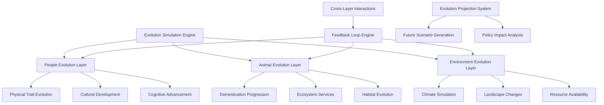

# Design Specification: Population Evolution System

## Architecture Overview

The Population Evolution System implements a revolutionary multi-layer simulation tracking the parallel development of People, Animals, and Environment across 10,000+ years of civilization development. This system creates emergent gameplay where long-term evolutionary pressures and feedback loops drive strategic decision-making.

### High-Level System Design



## Component Design

### People Evolution Layer
Comprehensive modeling of human population development across physical, cultural, and cognitive dimensions.

**Physical Trait Evolution Architecture**:
```python
class PhysicalTraitEvolution:
    def __init__(self):
        self.trait_categories = {
            'physical_attributes': {
                'height': TraitTracker(base_value=165, era_modifiers={}),
                'lifespan': TraitTracker(base_value=35, era_modifiers={}),
                'body_mass': TraitTracker(base_value=60, era_modifiers={}),
                'disease_resistance': TraitTracker(base_value=0.3, era_modifiers={})
            },
            'physical_capabilities': {
                'strength': TraitTracker(base_value=0.6, era_modifiers={}),
                'endurance': TraitTracker(base_value=0.7, era_modifiers={}),
                'sensory_acuity': TraitTracker(base_value=0.8, era_modifiers={})
            }
        }
        
    def evolve_traits_for_era(self, era, civilization_factors):
        """Calculate trait evolution based on era and civilization development"""
        evolution_results = {}
        
        for category, traits in self.trait_categories.items():
            category_results = {}
            for trait_name, trait_tracker in traits.items():
                # Apply era-specific evolutionary pressures
                era_pressure = self._calculate_era_pressure(trait_name, era)
                
                # Apply civilization-specific pressures
                civ_pressure = self._calculate_civilization_pressure(
                    trait_name, 
                    civilization_factors
                )
                
                # Calculate trait evolution
                evolution_amount = self._calculate_evolution_amount(
                    era_pressure, 
                    civ_pressure,
                    trait_tracker.current_value
                )
                
                new_value = trait_tracker.evolve(evolution_amount)
                category_results[trait_name] = {
                    'old_value': trait_tracker.previous_value,
                    'new_value': new_value,
                    'change_amount': evolution_amount,
                    'change_factors': {
                        'era_pressure': era_pressure,
                        'civilization_pressure': civ_pressure
                    }
                }
                
            evolution_results[category] = category_results
            
        return PhysicalEvolutionReport(evolution_results)

class CulturalEvolution:
    def __init__(self):
        self.cultural_dimensions = {
            'work_patterns': CulturalDimension('manual_labor', era_transitions={}),
            'social_structures': CulturalDimension('tribal', era_transitions={}),
            'leisure_activities': CulturalDimension('survival_focused', era_transitions={}),
            'value_systems': CulturalDimension('collective_survival', era_transitions={}),
            'dietary_patterns': CulturalDimension('hunting_gathering', era_transitions={})
        }
        
    def process_cultural_shift(self, era, technological_progress, policy_influences):
        """Model cultural evolution based on era advancement and policies"""
        cultural_changes = {}
        
        for dimension_name, dimension in self.cultural_dimensions.items():
            # Calculate cultural pressure from era advancement
            era_pressure = self._get_era_cultural_pressure(dimension_name, era)
            
            # Calculate pressure from technological advancement
            tech_pressure = self._get_technology_pressure(
                dimension_name, 
                technological_progress
            )
            
            # Calculate pressure from government policies
            policy_pressure = self._get_policy_pressure(
                dimension_name, 
                policy_influences
            )
            
            # Apply cultural inertia (resistance to change)
            inertia_factor = dimension.calculate_inertia()
            
            # Calculate net cultural shift
            total_pressure = era_pressure + tech_pressure + policy_pressure
            cultural_shift = total_pressure * (1.0 - inertia_factor)
            
            # Apply shift with generational delay
            new_state = dimension.apply_shift(cultural_shift)
            
            cultural_changes[dimension_name] = {
                'old_state': dimension.previous_state,
                'new_state': new_state,
                'shift_amount': cultural_shift,
                'pressure_sources': {
                    'era': era_pressure,
                    'technology': tech_pressure,
                    'policy': policy_pressure
                },
                'inertia_factor': inertia_factor
            }
            
        return CulturalEvolutionReport(cultural_changes)
```

### Animal Evolution Layer
Sophisticated modeling of domestication progression, ecosystem dynamics, and species evolution.

**Domestication System Architecture**:
```python
class DomesticationSystem:
    def __init__(self):
        self.domestication_stages = [
            'wild', 'attracted', 'semi_domesticated', 
            'domesticated', 'selectively_bred', 'bioengineered'
        ]
        
        self.species_populations = {
            'dogs': SpeciesPopulation('wild', utility_functions=['hunting', 'protection']),
            'cattle': SpeciesPopulation('wild', utility_functions=['food', 'labor']),
            'horses': SpeciesPopulation('wild', utility_functions=['transportation', 'warfare']),
            'pigs': SpeciesPopulation('wild', utility_functions=['food']),
            'chickens': SpeciesPopulation('wild', utility_functions=['food', 'eggs'])
        }
        
    def process_domestication_evolution(self, era, human_population, technology_level):
        """Model progression of animal domestication based on human development"""
        domestication_results = {}
        
        for species_name, population in self.species_populations.items():
            # Calculate domestication pressure
            human_pressure = self._calculate_human_interaction_pressure(
                species_name, 
                human_population, 
                era
            )
            
            # Technology enables advanced domestication
            tech_enablement = self._calculate_technology_enablement(
                species_name, 
                technology_level, 
                era
            )
            
            # Calculate domestication progression
            current_stage_index = self.domestication_stages.index(population.domestication_stage)
            max_stage_for_era = self._get_max_domestication_stage_for_era(era)
            
            if current_stage_index < max_stage_for_era:
                progression_chance = human_pressure * tech_enablement
                
                if self._check_domestication_advancement(progression_chance):
                    new_stage = self.domestication_stages[current_stage_index + 1]
                    population.advance_domestication_stage(new_stage)
                    
                    domestication_results[species_name] = {
                        'advancement': True,
                        'old_stage': self.domestication_stages[current_stage_index],
                        'new_stage': new_stage,
                        'progression_factors': {
                            'human_pressure': human_pressure,
                            'technology_enablement': tech_enablement
                        }
                    }
                    
            # Calculate population changes
            population_change = self._calculate_population_change(
                species_name, 
                population, 
                human_pressure, 
                era
            )
            
            population.update_population_size(population_change)
            
        return DomesticationReport(domestication_results)

class EcosystemServices:
    def __init__(self):
        self.service_categories = {
            'pollination': PollinationNetwork(),
            'soil_health': SoilEcosystemService(),
            'water_regulation': WaterCycleService(),
            'carbon_sequestration': CarbonService(),
            'biodiversity_maintenance': BiodiversityService()
        }
        
    def calculate_ecosystem_health(self, animal_populations, environmental_state):
        """Calculate overall ecosystem service capacity"""
        service_levels = {}
        
        for service_name, service_system in self.service_categories.items():
            # Calculate service capacity based on animal populations
            animal_contribution = service_system.calculate_animal_contribution(
                animal_populations
            )
            
            # Factor in environmental health
            environmental_modifier = service_system.calculate_environmental_modifier(
                environmental_state
            )
            
            # Calculate net service level
            service_level = animal_contribution * environmental_modifier
            
            service_levels[service_name] = {
                'current_level': service_level,
                'animal_contribution': animal_contribution,
                'environmental_modifier': environmental_modifier,
                'health_status': service_system.assess_health_status(service_level)
            }
            
        return EcosystemHealthReport(service_levels)
```

### Environment Evolution Layer
Comprehensive climate dynamics, landscape transformation, and resource availability modeling.

**Climate Dynamics Architecture**:
```python
class ClimateDynamics:
    def __init__(self):
        self.climate_variables = {
            'temperature': ClimateVariable(base_value=15.0, variation_range=(-5, 5)),
            'precipitation': ClimateVariable(base_value=1000, variation_range=(500, 2000)),
            'atmospheric_co2': ClimateVariable(base_value=280, variation_range=(180, 400)),
            'seasonal_variation': ClimateVariable(base_value=0.3, variation_range=(0.1, 0.8))
        }
        
        self.climate_cycles = {
            'ice_age_cycle': ClimateCycle(period=100000, amplitude=5.0),
            'solar_cycle': ClimateCycle(period=11, amplitude=0.1),
            'ocean_circulation': ClimateCycle(period=1000, amplitude=1.0)
        }
        
    def simulate_climate_evolution(self, era, human_impact, time_elapsed):
        """Simulate climate changes over time with human influence"""
        climate_changes = {}
        
        # Calculate natural climate variation
        natural_variation = self._calculate_natural_climate_variation(time_elapsed)
        
        # Calculate human impact on climate
        human_climate_impact = self._calculate_human_climate_impact(era, human_impact)
        
        for variable_name, variable in self.climate_variables.items():
            # Apply natural variation
            natural_change = natural_variation.get(variable_name, 0)
            
            # Apply human impact
            human_change = human_climate_impact.get(variable_name, 0)
            
            # Calculate total change with feedback loops
            feedback_modifier = self._calculate_climate_feedback(variable_name, variable.current_value)
            total_change = (natural_change + human_change) * feedback_modifier
            
            # Apply change with inertia
            new_value = variable.apply_change(total_change)
            
            climate_changes[variable_name] = {
                'old_value': variable.previous_value,
                'new_value': new_value,
                'natural_change': natural_change,
                'human_change': human_change,
                'feedback_modifier': feedback_modifier
            }
            
        return ClimateEvolutionReport(climate_changes)

class LandscapeTransformation:
    def __init__(self):
        self.landscape_metrics = {
            'forest_cover': LandscapeMetric(initial_value=0.8),
            'agricultural_land': LandscapeMetric(initial_value=0.0),
            'urban_area': LandscapeMetric(initial_value=0.0),
            'degraded_land': LandscapeMetric(initial_value=0.05),
            'biodiversity_index': LandscapeMetric(initial_value=0.9),
            'soil_quality': LandscapeMetric(initial_value=0.8)
        }
        
    def process_landscape_changes(self, era, population_pressure, technology_impact):
        """Model landscape transformation due to human development"""
        transformation_results = {}
        
        # Calculate development pressure
        development_pressure = self._calculate_development_pressure(
            era, 
            population_pressure, 
            technology_impact
        )
        
        # Calculate conservation efforts
        conservation_factor = self._calculate_conservation_efforts(era, technology_impact)
        
        for metric_name, metric in self.landscape_metrics.items():
            # Calculate transformation pressure for this metric
            transformation_pressure = development_pressure.get(metric_name, 0)
            
            # Apply conservation modifiers
            net_pressure = transformation_pressure * (1.0 - conservation_factor)
            
            # Calculate ecosystem resilience
            resilience = metric.calculate_resilience()
            
            # Apply change with resilience factor
            change_amount = net_pressure * (1.0 - resilience)
            new_value = metric.apply_change(change_amount)
            
            transformation_results[metric_name] = {
                'old_value': metric.previous_value,
                'new_value': new_value,
                'change_amount': change_amount,
                'pressure_sources': {
                    'development': transformation_pressure,
                    'conservation_mitigation': conservation_factor,
                    'resilience': resilience
                }
            }
            
        return LandscapeTransformationReport(transformation_results)
```

### Cross-Layer Interaction System
Complex feedback loops and interactions between People, Animals, and Environment layers.

**Feedback Loop Engine Architecture**:
```python
class CrossLayerInteractions:
    def __init__(self):
        self.interaction_matrix = self._build_interaction_matrix()
        self.feedback_loops = self._initialize_feedback_loops()
        self.cascade_effects = CascadeEffectCalculator()
        
    def process_cross_layer_effects(self, people_state, animal_state, environment_state):
        """Calculate complex interactions between all evolution layers"""
        interaction_results = {}
        
        # People → Environment interactions
        people_env_effects = self._calculate_people_environment_interactions(
            people_state, 
            environment_state
        )
        
        # People → Animals interactions
        people_animal_effects = self._calculate_people_animal_interactions(
            people_state, 
            animal_state
        )
        
        # Animals → Environment interactions
        animal_env_effects = self._calculate_animal_environment_interactions(
            animal_state, 
            environment_state
        )
        
        # Environment → People interactions
        env_people_effects = self._calculate_environment_people_interactions(
            environment_state, 
            people_state
        )
        
        # Environment → Animals interactions
        env_animal_effects = self._calculate_environment_animal_interactions(
            environment_state, 
            animal_state
        )
        
        # Animals → People interactions
        animal_people_effects = self._calculate_animal_people_interactions(
            animal_state, 
            people_state
        )
        
        # Calculate cascade effects
        cascade_effects = self.cascade_effects.calculate_cascades([
            people_env_effects, people_animal_effects, animal_env_effects,
            env_people_effects, env_animal_effects, animal_people_effects
        ])
        
        interaction_results = {
            'direct_interactions': {
                'people_to_environment': people_env_effects,
                'people_to_animals': people_animal_effects,
                'animals_to_environment': animal_env_effects,
                'environment_to_people': env_people_effects,
                'environment_to_animals': env_animal_effects,
                'animals_to_people': animal_people_effects
            },
            'cascade_effects': cascade_effects,
            'net_layer_changes': self._calculate_net_layer_changes(
                people_env_effects, people_animal_effects, animal_env_effects,
                env_people_effects, env_animal_effects, animal_people_effects,
                cascade_effects
            )
        }
        
        return CrossLayerInteractionReport(interaction_results)
        
    def _calculate_people_environment_interactions(self, people_state, environment_state):
        """Calculate how population development affects environment"""
        effects = {}
        
        # Population pressure on environment
        population_pressure = people_state.population_size * people_state.consumption_rate
        
        # Technology mitigation effects
        tech_mitigation = people_state.environmental_technology_level
        
        # Calculate environmental impacts
        effects['pollution_generation'] = population_pressure * (1.0 - tech_mitigation)
        effects['resource_extraction'] = people_state.resource_demand
        effects['land_use_change'] = people_state.urbanization_rate
        effects['conservation_efforts'] = people_state.environmental_awareness * tech_mitigation
        
        return EnvironmentalImpactCalculation(effects)
```

## Data Model

### Evolution State Tracking
Comprehensive data structures for tracking multi-generational evolution across all layers.

```python
class EvolutionState:
    def __init__(self):
        # People evolution data
        self.people_evolution = {
            'physical_traits': PhysicalTraitState(),
            'cultural_patterns': CulturalState(),
            'cognitive_development': CognitiveState(),
            'population_demographics': DemographicState()
        }
        
        # Animal evolution data
        self.animal_evolution = {
            'species_populations': SpeciesPopulationState(),
            'domestication_levels': DomesticationState(),
            'ecosystem_services': EcosystemServiceState(),
            'habitat_changes': HabitatState()
        }
        
        # Environment evolution data
        self.environment_evolution = {
            'climate_variables': ClimateState(),
            'landscape_metrics': LandscapeState(),
            'resource_availability': ResourceState(),
            'pollution_levels': PollutionState()
        }
        
        # Cross-layer interaction tracking
        self.interaction_history = CrossLayerInteractionHistory()
        self.feedback_loop_states = FeedbackLoopStateTracker()
        
    def get_evolution_snapshot(self, timestamp):
        """Get complete evolution state at specific time"""
        return EvolutionSnapshot(
            timestamp=timestamp,
            people_state=self.people_evolution.copy(),
            animal_state=self.animal_evolution.copy(),
            environment_state=self.environment_evolution.copy(),
            interaction_state=self.interaction_history.get_state_at(timestamp)
        )
        
    def calculate_evolution_trends(self, time_window):
        """Calculate evolution trends over specified time period"""
        snapshots = self._get_snapshots_in_window(time_window)
        
        trends = {
            'people_trends': self._calculate_people_trends(snapshots),
            'animal_trends': self._calculate_animal_trends(snapshots),
            'environment_trends': self._calculate_environment_trends(snapshots),
            'interaction_trends': self._calculate_interaction_trends(snapshots)
        }
        
        return EvolutionTrendAnalysis(trends)
```

### Future Projection Data
Sophisticated scenario modeling for evolutionary projections and policy impact analysis.

```python
class EvolutionProjection:
    def __init__(self, base_state, projection_horizon):
        self.base_state = base_state
        self.projection_horizon = projection_horizon
        self.scenarios = []
        self.policy_impacts = {}
        
    def generate_projection_scenarios(self, policy_options):
        """Generate multiple future scenarios based on different policy choices"""
        scenarios = []
        
        for policy_set in policy_options:
            scenario = self._simulate_evolution_path(
                self.base_state,
                policy_set,
                self.projection_horizon
            )
            scenarios.append(scenario)
            
        self.scenarios = scenarios
        return scenarios
        
    def _simulate_evolution_path(self, initial_state, policies, time_horizon):
        """Simulate evolution over time horizon with given policies"""
        simulation_state = initial_state.copy()
        evolution_path = [simulation_state]
        
        for year in range(time_horizon):
            # Apply yearly evolution
            yearly_changes = self._calculate_yearly_evolution(
                simulation_state, 
                policies, 
                year
            )
            
            simulation_state = self._apply_evolution_changes(
                simulation_state, 
                yearly_changes
            )
            
            evolution_path.append(simulation_state.copy())
            
            # Check for collapse or breakthrough conditions
            if self._check_civilization_collapse(simulation_state):
                return CollapseScenario(year, simulation_state, evolution_path)
            elif self._check_breakthrough_conditions(simulation_state):
                return BreakthroughScenario(year, simulation_state, evolution_path)
                
        return ProjectionScenario(evolution_path, policies)
```

## API Specification

### Evolution Management API
```python
class EvolutionManager:
    def process_era_evolution(self, era_transition: EraTransition) -> EvolutionReport:
        """Process evolution changes during era transition"""
        
    def get_current_evolution_state(self) -> EvolutionState:
        """Get current state across all evolution layers"""
        
    def project_future_evolution(self, policies: List[Policy], 
                                time_horizon: int) -> List[ProjectionScenario]:
        """Generate future evolution projections based on policy choices"""
        
    def calculate_policy_impact(self, policy: Policy) -> PolicyImpactAnalysis:
        """Analyze impact of specific policy on evolution"""
```

### Cross-Layer Interaction API
```python
class CrossLayerInteractionEngine:
    def calculate_feedback_loops(self, evolution_state: EvolutionState) -> FeedbackLoopAnalysis:
        """Calculate current feedback loop strengths and effects"""
        
    def simulate_cascade_effects(self, initial_change: EvolutionChange) -> CascadeAnalysis:
        """Simulate cascade effects from initial evolution change"""
        
    def get_interaction_strength_matrix(self) -> InteractionMatrix:
        """Get current strength of interactions between evolution layers"""
```

## Security Considerations

### Simulation Integrity
- **Data Validation**: Ensure evolution parameters remain within realistic bounds
- **Consistency Checking**: Validate cross-layer interactions for logical consistency
- **Performance Monitoring**: Prevent runaway calculations in complex simulations

### Computational Resources
- **Memory Management**: Efficient storage of multi-generational evolution data
- **Processing Limits**: Bounded computation time for evolution calculations
- **Cache Management**: Intelligent caching of frequently accessed evolution states

## Performance & Scalability

### Computational Efficiency
- **Background Processing**: Evolution calculations during turn transitions
- **Selective Detail**: Full detail only where player decisions create significant impact
- **Approximation Algorithms**: Use statistical models for large-scale population effects
- **Parallel Processing**: Multi-threaded evolution calculations where possible

### Memory Optimization
- **Data Compression**: Efficient storage of evolution history data
- **Selective Persistence**: Keep detailed records only for significant evolutionary events
- **Garbage Collection**: Automatic cleanup of old, irrelevant evolution data
- **Streaming**: Load evolution data on-demand rather than keeping everything in memory

### Scalability Targets
- **Evolution Processing**: < 10 seconds for era transition evolution calculations
- **Projection Generation**: < 30 seconds for 1000-year projection scenarios
- **Memory Usage**: < 1GB for complete evolution state data
- **Cross-Layer Calculations**: < 5 seconds for feedback loop analysis

## Implementation Considerations

### Scientific Accuracy
- **Research Base**: Ground evolution models in real scientific research
- **Parameter Validation**: Ensure all evolution parameters have scientific basis
- **Expert Review**: Scientific validation of evolution modeling approaches
- **Uncertainty Modeling**: Acknowledge and model uncertainty in long-term projections

### Gameplay Integration
- **Player Agency**: Ensure player decisions meaningfully affect evolution outcomes
- **Feedback Clarity**: Clear visualization of evolution impacts and trends
- **Strategic Depth**: Evolution consequences that reward long-term thinking
- **Narrative Integration**: Evolution changes that enhance rather than complicate storytelling

### Extensibility Framework
- **Modular Design**: Easy addition of new evolution factors and interactions
- **Configuration-Driven**: Evolution parameters adjustable through configuration files
- **Plugin Architecture**: Support for custom evolution models and extensions
- **API Design**: Clean interfaces for integration with other game systems
